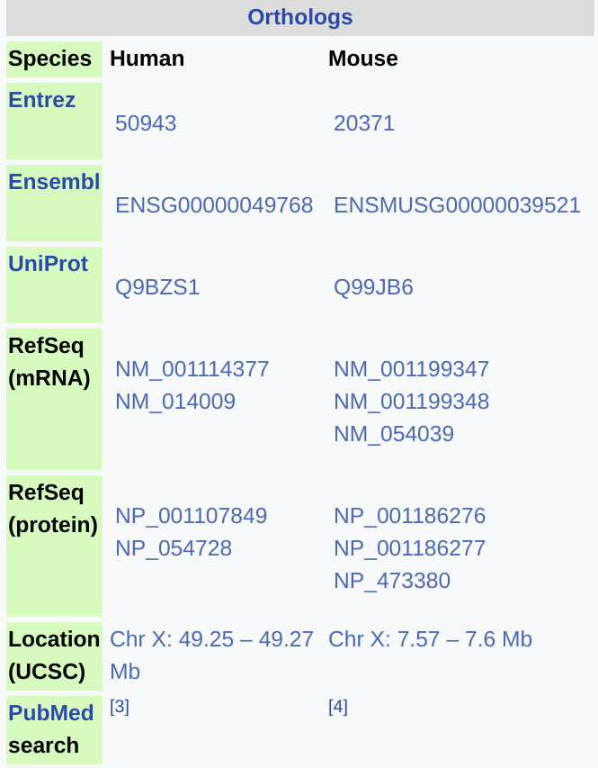

```{r, loadPackages, echo = FALSE, include = FALSE}
library(knitr)
opts_chunk$set(
  echo = TRUE, include = TRUE, 
  results = "hide",
  warning = FALSE, message = FALSE, 
  out.width = 800, fig.align = "center",
  fig.show = "hide"
)
```

# Introduction

Before we start, don't forget to setup a new R project for `practical_4` and save all of your code there!

# The Bioconductor Project

## CRAN Packages

As we've seen in the first few weeks, a *package* is really just a collection of functions which performed related tasks.
When we install R for the first time, the only packages which are installed are known as the *standard library*.
These include `base`, `cluster`, `datasets`, `graphics`, `methods`, `parallel`, `stats`, `utils` and a handful of others.
These are fundamental to the basic operation of R.

All other packages we need to install ourselves, and the primary repository for all of these packages is [CRAN](https://cran.r-project.org/).
Currently, there are >15,000 packages available here, and we can install any of them using the syntax `install.packages("packageName")`.
(Clearly that won't work, so there's no need to try it).
Packages on CRAN cover the entire breadth of data analysis, ranging from classical statistics to machine learning, finance and biological research.

Anyone can submit a package to CRAN, with a useful recent package submitted by a "friend of the Bioinformatics Hub" being [`ggeasy`](https://cran.r-project.org/web/packages/ggeasy/index.html).
In order to have a package submitted, all you essentially need to do is write a collection of functions you think are useful, build as a package, and ensure this passes the automated technical checks by CRAN.
Most packages are submitted by academics, and most packages have an associated publication, so this works very well for the most part.
Any poor packages generally fall by the wayside fairly quickly.

## Bioconductor

Back in 2001, a group of biologically-focussed researchers, lead by Robert Gentleman (one of the two who `R` was named after in 1992) realised that the systems on CRAN may be inadequate.
A second repository was formed focussed on biological research, called *The Bioconductor Project*.
All 1800+ packages on [Bioconductor](https://www.bioconductor.org/) are to enable biological research, and a huge component of this is for transcriptomic analysis.

Any package that is accepted on Bioconductor is peer-reviewed **before** being accepted, in addition to being given a far more stringent series of technical tests than those provided by CRAN.
The Bioconductor Project also provide a series of packages which define fundamental object structures and classes to enable specific analysis types.
For example, `DGEList` object are defined in the package `edgeR` and these are specifically for analysing RNA Seq data, whilst `SingleCellExperiment` objects are defined to enable the analysis of scRNA Seq.
The use of these existing object classes is encouraged strongly amongst the Bioconductor community giving a consistency between packages which is missing from CRAN.
There are many more of these, which we'll explore later in the session.

### S3 Vs S4 objects

#### S3 Objects

We've briefly mentioned this in previous sessions, but R has two primary systems of deciding how to call the right function for the right object class.
These are known as `S3` and `S4` with their own system of method dispatch (this is the way functions are correctly called).

The main objects we have seen, such as *vectors*, `tibble` and `data.frame` objects use the `S3` system.
As a quick example, we've seen the `print()` function before, but this behaves differently for different types of objects.
To look inside the function, we can use the function `body()`.

```{r}
body(print)
```

This makes no sense initially, but what R does when it sees this with an `S3` object, is to check the `class` of the object and look for the function `print.xxxx()`.
For example, if the class of the object is `data.frame`, R will look for the function `print.data.frame()`.
This contains the instructions for how to print the contents of a `data.frame`.
Try this, but worry about understanding the code.

```{r}
body(print.data.frame)
```

Alternatively, if the object is a `factor`, R would look for `print.factor()`.

```{r}
body(print.factor)
```

These methods are how R knows to dump all of the contents of an object into your console, and this is how the function `print.tbl()` knows how to make your `tibble` objects look pretty.
Some of these methods are hidden from view (for some reason), but we can see all the print methods that exist in our current environment by typing:

```{r}
methods(print)
```

Now load the `tidyverse` and try it again.

```{r, eval=FALSE}
library(tidyverse)
methods(print)
```

There's now nearly double the number that we had before!

S3 objects have a pretty loose structure and you can easily break them.
As an easy example, try this:

```{r, eval=FALSE}
x <- 1:5
class(x) <- "factor"
print(x)
```

Here, we've created an integer vector `x` but then we've (maliciously) assigned the class attribute `class(x) <- "factor"`.
Now when we try to print the object, R will expect a factor and looks for the values and levels to display them in a nice format.
Because it can't find them, an error is generated.
We just broke R!!!

#### S4 Objects

`S4` Objects are far more stringent and have a hierarchical system of method dispatch, in keeping with other *Object Oriented Programming* systems.
Bioconductor relies very heavily on these object types, and they have very much become the leaders in this area.
Whilst its easy to hack `S3` objects (like we did), this is far more difficult for `S4` objects.

`S4` objects actually check that the object structure is valid during formation, and every time you attempt to modify them.
This can make them quite infuriating, but we end up with objects that **ALWAYS** have what you expect, where you expect it.
With large -omics objects, this can be very helpful.

Whilst they very much resemble a list, `S4` objects can have quite unusual structures and we often access different elements using functions rather by subsetting.

As a simple thought exercise, imagine you are comparing SNPs from a GWAS analysis, with gene locations from a given genome build.
When you load the SNPs into R, you will assign an underlying genome structure including chromosome names and lengths.
When you compare with gene locations, these two objects **must** have the same underlying chromosome names and lengths, i.e. they must be the same genome build.
Using `S4` objects allows for easy checking of conditions like this.

There is also an `S4` version of a data.frame (known as a `DataFrame`) which predate `tibble` objects by several years, and which plays very nicely with genomic data.
Unfortunately they play poorly with the `tidyverse` as the conflict between the `S3` and `S4` systems makes this a non-trivial challenge.
People are working on it, but it's not a solved problem yet.

### Vignettes

A final important feature of packages accepted onto Bioconductor is that all packages must come with a vignette which explains how to use the package.
This is option on CRAN (`ggeasy` comes with one), but is absent more often than many of us would like.

To see which packages have a vignette, you can enter the command `browseVignettes()` into the *Console*.
This should open an html page with links to every vignette in your R installation.
*Unfortunately, they don't seem to be working on the VMs*, but they will be accessible on a local installation should you set one up later.
However, all vignettes are available on the Bioconductor website where each package has it's own page.
Two great examples might be the package [Genomic Ranges](https://bioconductor.org/packages/release/bioc/vignettes/GenomicRanges/inst/doc/GenomicRangesIntroduction.html) or the package [ngsReports](https://bioconductor.org/packages/release/bioc/vignettes/ngsReports/inst/doc/ngsReportsIntroduction.html).

## Packages

Bioconductor also has a system called `biocViews` which can help you find suitable packages.
To use this, head to the [BiocViews](https://www.bioconductor.org/packages/release/BiocViews.html#___Software) page.

Here you'll see that packages are broadly broken into:

1. *Software*: These are the packages which contain the algorithms and methods for actual data analysis, 
2. *AnnotationData*: These are the packages which enable access to all of the annotations for genome and transcriptome build, gene set analyses etc
3. *ExperimentData* packages contain example data for training and learning.
4. *Workflow* packages describe common workflows

*Try looking in the `Software > Statistical Method` packages for the term RNA* and you'll see packages which have this somewhere in the Title.
However you'll notice that a couple of key packages (`edgeR` and `limma`) disappeared, so a careful choice of search terms is advised.
Try again using `gene`...

### Package Installation

Whilst package installation has mainly been done for you on the VMs, Bioconductor packages are not on CRAN, therefore, they cannot be installed using `install.packages()`.
The clever Bioconductor people have added a package to the CRAN repository which gets around this called `BiocManager`.
I usually call this directly using the namespace as it's something we tend to perform interactively.
Loading packages is usually a one-off thing and not something that we need to script.
Let's have a look at a couple of key functions.

```{r, eval=FALSE}
?BiocManager::install
```

This function can install packages from either CRAN or Bioconductor.
Let's install Jono Carroll's package `ggeasy`.

```{r, eval=FALSE}
BiocManager::install("ggeasy")
```

This is a pretty quick installation, and once it's done you'll get the standard messages at the end, asking if you'd like to *update packages which have recently been updated.*
Type `n` + <kbd>Enter</kbd> to say **no**.

(The bit about `Installation path not writeable` is referring to some of the packages from the standard library. These are often installed in directories with restricted write permissions, and this is what happened when you setup your VMs. Once again, this likely won't be a problem when running a local installation.)

Another **extremely helpful** function is `BiocManager::valid()`.
This checks your installation for any package conflicts or updates, and suggests a line of code for you to run in order to fix them.
It looks like quite a few packages have been updated since we built the VMs!
You can copy and paste that code if you like, but it will take about 5 minutes to complete the package updates.

Notice that many of those packages were from CRAN (`dplyr`, `broom`, `forcats` etc), whilst other packages were from Bioconductor (`Rsamtools`, `edgeR`, `tximport`).

# Annotation

Some of the most helpful packages on Bioconductor are the Annotation packages.
This is where we get our gene models, gene sets, genomic co-ordinates, sequence information and many other useful types of information.
But first, let's take a quick tour of some key online databases

## Genomic Databases

So this section is not related to R at all, but instead, we're going to look at 3 key resources that are in common use and may form the foundation of everything we do.
One of my favourite genes is *FOXP3*, so let's go to the [Wikipedia page](https://en.wikipedia.org/wiki/FOXP3).
On the far right, you'll see the Orthologs frame.

{ width=200px }

Here there are a few links to different resources, but for us transcriptomic people, there are 3 we'll look at.

### Entrez Gene

For the human version of the gene, open the link to the Entrez Gene page in a new Tab, by right-clicking the `50943` link.
This will take you to the Gene section within the American Entrez database, run by the NCBI.
Notice that the identifier was an integer, this is how all EntrezGene identifiers are defined.
(*And now think for a moment about using these as rownames for a matrix. Likely to cause any confusion?*)

Clearly every well known gene is defined here, and there is loads of useful information about each gene, including tissue-specific expression, associated Gene Ontology terms, Pathways, known interacting proteins etc.

The NCBI has many databases like this, including RefSeq GenBank, dbSNP and dbEST.
For transcriptomics, Entrez Gene is the most useful, although the heavily curated data in RefSeq can sometimes be used.
If you look at the transcripts displayed near the top of the Entrez Gene page for FOXP3, you'll notice that each of the transcripts has a RefSeq identifier (e.g. NM_001114377.2).

### Ensembl

The *European equivalent* to the NCBI is Ensembl, so going back to the Wiki page, now click the link that takes you to Ensembl (`ENSG00000049768`).
Firstly notice that the identifier starts with `ENSG` indicating it is an Ensembl Gene, with the numeric section following.
(*And now think for a moment about using these as rownames for a matrix. Likely to cause any confusion?*)

Notice again that we have a different set of transcripts, which all begin with `ENST`.
Try having a look around at all of the different sections here by clicking on random things that seem interesting.

**At the Entrez Gene page, there were 4 transcripts, but here there are 9. Why are they different? Which is correct?**

### UCSC

The final link we'll click is the one that takes us to the UCSC, down near the bottom of the table.
This will take us to the UCSC genome browser, run by the University of California, Santa Cruz.
This is an extremely useful visualisation tool, and you can add many features to the plot.
By default this *should* (?) open with the two primary RefSeq transcripts displayed.
Now try adding `Other RefSeq` by selecting `full` from the drop-down menu, and clicking the <kbd>refresh</kbd> button over on the right.

Once you've had a look, select `hide` from the drop-down menu and refresh the browser again.
This time add the `full` display for `GENCODE32` and refresh.
Now you'll have a larger set of transcripts.
Right-click on one of them and choose `Open details page in new window...`.
Here you'll see we have information based on Ensembl, whilst if you repeat these steps on one of the original transcripts we saw, you'll notice it's a RefSeq transcript.

### Why so many databases

These 3 are the 'big guns' of what we need, but why are there 3?
The NCBI is the oldest and they decided on their way of doing things a long time ago.
The Europeans figured that there were a few problems with how the NCBI did things, so they designed their own system to 'improve things'.
All of this took place when genomic information was much smaller and everyone knew a lot less about what limitations they might face.

The UCSC resource has (visually) the best browser of the lot, and under the hood there are hundreds of SQL tables mapping pieces of information to each other.

In reality, they all play together relatively nicely, and you'll see links to the other databases on each of the sites.
For some things where they differ, the NCBI may have the correct information, whilst for others Ensembl may have the best viewpoint.
Or they might all be wrong.

The database we work with is very much a personal preference, but in the Bioinformatics Hub, most transcriptomic work is done using Ensembl.
Given that Bioconductor is hosted in the US, this may be worthy of note...

And finally


## BioMart

### Using the GUI

One of the oldest and most commonly used strategies for retrieving genomic information is to use the package `biomaRt`.
This connects to the same server that is hosted for the main `BioMart` resource on [Ensembl](http://asia.ensembl.org/biomart/martview/1315c481d27ea044e8eb5f1553253103).
Let's try and manually obtain information about FOXP3 from the server using the GUI.

Firstly, we'll need to select our database, which is just the section of the larger resource to look in.
Choose `Ensembl Genes 99`, which is just release 99 of the database focussed around genes.
From here, we'll need to choose our *dataset*, so lets choose Human genes (GRCh38.p13), which is the particular genome build we'll look in.

Now we need to decide which attributes we wish to download, and by default it's selected a few for us.
We don't need those *ID versions*, so let's click on `Attributes > Gene` and you'll see the check boxes.
Unselect the two with ID versions, and add the Gene name, Chromosome, Strand, Transcript Start and Transcript End.
In addition, go to the `External` box and add `NCBI gene ID`.
This completes the set of information we wish to extract.

The next step we need to do is just restrict this to FOXP3, and we do this by applying a filter.
Click on the `Filters` link on the left and expand the `GENE` section.
Click the `Input external references ID list`, then use the drop-down menu to select `Gene Name(s)`.
Now type in FOXP3 and we're ready to ask for our results.

To get these, click the `Results` button at the top left and an html preview will eventually appear.
This is everything we want, so let's download it by selecting `Go` after the Export all results to File/TSV.
This should ask you to save a file called `mart_export.txt`.
Rename this as FOXP3.tsv and save it where you like.

That's it, this is how we get information from the BioMart server using the GUI.
We've already seen the preview in the HTML section and what we have can be imported into R using `read_tsv()` if you'd like

### `biomaRt`

```{r, echo=FALSE}
knitr::opts_chunk$set(
    eval = FALSE
)
```


The reproducible version of what we've just done can be performed using the Bioconductor package `biomaRt`, so let's load this in your opening `packages` chunk.
Just to make sure we're in a clean session, without anything else loaded, please select `Session > Restart R`, which will unload any packages and clean your workspace.

```{r}
library(biomaRt)
library(tidyverse)
```

(You may have seen an interesting & new message in the Conflicts there.)

We have to go through the exact same process as using the GUI, but this time we'll do it using arguments to a function.
If you recall, the steps we took were:

1. Select the database
2. Select the dataset (i.e. genome build)
3. Define the attributes we wish to obtain
4. Set a filter to restrict the results to the gene we need.

When we used the GUI we were given our choices via a drop-down menu, however, when we're working R we have to find this information ourselves.

The function we use to actually obtain the data is `getBM()`.
So let's look at the help page and you'll see the arguments for all of those parameters. (`?getBM`)
In following sections, we'll define everything we need for the first four arguments to `getBM()`

#### Select the database

Firstly we have to establish a connection between our R session and the BioMart server, and this is defined as a "mart".
To find the available marts, we can use `listEnsembl()`.
Just enter this in Console, as all we're looking for is information to use in our code.
Choose the first one by using the following code

```{r}
mart <- useEnsembl("ensembl")
```

This is an S4 object, which establishes the connection to the server, and as we saw, this is Ensembl Release 99.
However, this would always be the latest release of Ensembl, so if you're strictly after reproducible research, there are ways to specify exact releases.

#### Select the dataset

Next we need to select our dataset, and once again we use `listDatasets()` setting `mart` as the connection.

```{r}
listDatasets(mart) %>%
    as_tibble()
```

As you can see, we have hundreds to choose from, so let's use our existing skills to find `GRCh38`.

```{r}
listDatasets(mart) %>%
    as_tibble() %>%
    dplyr::filter(
        str_detect(description, "GRCh38")
    )
```

So the dataset we'll need is `"hsapiens_gene_ensembl"`.
We can add that to our mart connection:

```{r}
mart <- useEnsembl(
    biomart = "ensembl", 
    dataset = "hsapiens_gene_ensembl"
    )
```

We'll use that information later, just remember it for now.

#### Define the attributes

When we used the GUI, we clicked on check-boxes that were provided for us, but now we need to find the names of all of those check-boxes for our `biomaRt` connection.

```{r}
allAttributes <- listAttributes(mart) %>%
    as_tibble()
allAttributes
```

The first attributes we need will be `ensembl_gene_id` and `ensembl_transcript_id`
**Try and find the other attributes we had earlier and add them to the following vector.**
You may need to use some searching tricks such as `filter` and `str_detect()`


```{r}
att2Get <- c("ensembl_gene_id", "ensembl_transcript_id")
```

#### Define a filter

Our final step will be to define a filter so that we only return information for FOXP3.
There are two things we need here:

1. What field we are using for the filter (we set this using the drop-down menu in the GUI)
2. The value we are filtering by (*FOXP3*)


```{r}
allFilters <- listFilters(mart) %>% 
    as_tibble()
allFilters %>%
    filter(str_detect(description, "Gene Name"))
```

Take note of the one you think is the most appropriate.

#### Search BioMart

Now we have everything, we're ready to go.
As is my habit, we'll immediately convert to a `tibble`.
This is pretty small, but sometimes we get back information which is thousands of lines line.


```{r}
bm <- getBM(
    attributes = att2Get,
    filters = "external_gene_name",
    values = "FOXP3",
    mart = mart
) %>%
    as_tibble()
```

And that's it. 
Now we know how to remotely connect to the BioMart server on Ensembl and import all the data we need for our analysis.

#### One final hot tip

Unfortunately, the BioMart server can be intermittent.
This only happens once every few hundred connections, but you may well connect hundreds of times.
Saving your code and the data you obtain as a tsv can be prudent sometimes.

If I'm honest, it played up while compiling this practical...

# Annotation Data Objects

## Annotation Hub

Sometimes, other people have done the heavy lifting for us and have created annotation objects which we can download and access locally from our R session.
There are literally thousands of Annotation packages on Bioconductor and the package `AnnotationHub` holds the metadata for all as many of them as have been submitted to it.

```{r}
library(AnnotationHub)
```

The easiest way to see what data is available is to create what is known as an *AnnotationHub* object.
The following line of code will check the remote server to see if anything has been updated since you last checked, and will return a metadata object letting you know what's available.
(If R asks you any questions here, just answer yes.)

```{r}
ah <- AnnotationHub()
ah
```

As we can see there are 48,092 annotation packages we can access directly here.
This is one of those `S4` objects in common use by the Bioconductor community so unfortunately, it doesn't play well with the `tidyverse`.
However are the top of the above output, you'll see the three key fields listed (`dataprovider`, `species` and `rdataclass`).
We can use these to find the information we need, and instead of `filter()`, we'll use `subset`.

```{r}
ah %>%
    subset(dataprovider == "Ensembl")
```

Now you can see that we have data available for multiple species and three `rdataclass` entries tell us what type of data we can obtain.
Underneath this you can see 
```
# additional mcols(): taxonomyid, genome, description,
#   coordinate_1_based, maintainer, rdatadateadded,
#   preparerclass, tags, rdatapath, sourceurl, sourcetype 
```

In the Bioconductor community, objects like this often have an `mcols` slot, which we can return, and these are the complete set of fields we can pass to `subset()`.

```{r}
mcols(ah)
```

You may notice, that this returns a `DataFrame`.
This is an alternate (`S4`) implementation of a `data.frame` and takes an alternative tidying up strategy to a `tibble`.
Here you are shown all columns, but just the first few rows, followed by some dots and the last few.
This can be a handy approach in genomics as there may be weird chromosome/scaffold names hiding at the end.

Let's search a little harder and try to find something useful.
Let's find an object class called a `Genomic Ranges` object (`GRanges` for short)

```{r}
ah %>%
    subset(dataprovider == "Ensembl") %>%
    subset(rdataclass == "GRanges") %>%
    subset(species == "Homo sapiens")
```

This provides a list of records we can load into our R session

## Genomic Ranges

Let's grab the one that matches Ensembl Release 99.
**Notice that we use the double brackets to extract this object. What would happen if we used the single brackets?**

```{r}
gr <- ah[["AH79161"]]
```

If you don't already have this downloaded, Annotation Hub will start downloading this from the Bioconductor website, which may take a minute or 5.
Once you've downloaded it for the first time, a copy will be saved on your VM so it'll load near instantly the next time.
While, it's downloading, let's think about these objects.

A Genomic Ranges object, contains information about regions of the genome, considering them to be ranges.
This is quite intuitive really.
These objects are very common and form the backbone of many genomic/transcriptomic analyses.
The particular data file which this has been derived from is known as a *gtf* file.

This is a common format and contains genomic information about regions such as exons, transcripts, genes and UTRs.
Not only do they contain the regions, with the requisite identifiers, there is strand information, gene names, gene/transcript biotype information etc.
They are very information rich, and are essentially just a tsv, with a very tight set of restrictions about what order the columns are in, and what to include in the header.

Once you've downloaded this object, have a look by just typing it's name (`gr`).
You'll notice that we have nearly 3,000,000 ranges here!

To the left of the `|` symbol you have the ranges defined and these are the backbone of these objects, containing the key information about where in the genome we have information.
We can just access this part of the object using `granges()`, and this just returns these ranges.

```{r}
granges(gr)
```

To the right of the `|` symbol we have the `mcols()` section, which are the metadata columns for each range.
Once again, we can access this metadata using the `mcols()` function. 

```{r}
mcols(gr)
```

This is our now-familiar `DataFrame` format and with a bit of work, we can turn these into a `tibble` and go nuts with `dplyr`.
We'll leave that for later though.

As we saw earlier, the `S4` version of `filter` is to use `subset`, so let's use that to just get the genes.

```{r}
gr %>%
    subset(type == "gene")
```

Obviously, we can search this for `FOXP3`

```{r}
gr %>%
    subset(
        type == "gene" & gene_name == "FOXP3"
        )
```

There are quite a few irrelevant empty columns here, but let's just ignore that.
In a real analysis we'd probably delete them using

```{r}
cols2Keep <- c(
    "source", "type", "gene_id", "gene_name",
    "gene_biotype", "transcript_id", 
    "transcript_biotype"
    )
mcols(gr) <- mcols(gr)[cols2Keep]
```

OK, you may as well run that.

We can also get our transcript information

```{r}
gr %>% 
    subset(type == "transcript" & gene_name == "FOXP3")
```

This is what we obtained from `biomaRt` earlier.
Notice how much easier it was!

Unfortunately, we don't always have these objects waiting for us, so knowing how to use `biomaRt` is a pretty important skill.
There is also a huge array of data tables and fields in BioMart that you simply can't get with a `GRanges` object (e.g. Affymetrix Probe IDs)

### The `seqinfo` element

Underpinning these `GRanges` object is something called ` Seqinfo` object, even though it's hidden from view at the moment.
We can see this by using the code:

```{r}
seqinfo(gr)
```

This contains the chromosome names and lengths.
When you're comparing two `GRanges` objects, these must match *exactly*.
This is very sensible as it ensure we are always comparing like with like.
However, they can get bit a messy.

Here, we have missing chromosome lengths, so we'd have to put them in manually before comparing with another object without missing lengths.

## `TxDb` / `EnsDb` Objects

When we loaded the `GRanges` object, it contained exons, transcripts and multiple types of ranges.
(The ranges were just ranges, it's the type of biological feature that changed).
We can inspect those by just grabbing that `type` column with the `$` separator.

```{r}
table(gr$type)
```

Sometimes, we like to have everything neatly organised for us and two objects types which are very useful are `TxDb` and `EnsDb` objects.
`TxDb` objects are based around NCBI and UCSC annotations, whilst `EnsDb` objects are based around Ensembl annotations.

In the Bioinformatics Hub we mainly work with `EnsDb` objects, as we prefer Ensembl annotations.
(Seriously, who makes integer identifiers!!!)

```{r}
ah %>% 
    subset(rdataclass == "EnsDb" & species == "Homo sapiens")
```

Let's get that last one and save it as an R object.
Again, this may take a while the first time you save it, but it will be near instantaneous the next time.

```{r}
ensDb <- ah[["AH78783"]]
ensDb
```

Now to get any information about transcripts or genes, we can just use the accessor functions `transcripts()` or `genes()`

```{r}
tr <- transcripts(ensDb)
gr <- genes(ensDb)
```

The mcols from these objects are now quite refined and targeted, as they're not restricted to the fields in the `gtf` format.
All the information we obtained from `biomaRt` is now just here and accessible!
We even have mappings to `entrezid`

```{r}
gr %>% subset(!is.na(entrezid))
```

Notice that for some genes, we don't have 1:1 mappings, just to make life easy for us.

One of the many useful features of these objects, is you can extract exons for your genes or transcripts with ease, as a `GRangesList`.
These are literally a `list` object, with a `GRanges` object at every position.

```{r}
exByG <- exonsBy(ensDb, "gene")
```

So we could now obtain the exon coordinates for *FOXP3* using our double brackets method.

```{r}
exByG[["ENSG00000049768"]]
```

Some of these may overlap or be the same exons with different names from different transcripts, so we can use the `reduce()` function to merge overlapping regions.

```{r}
exByG[["ENSG00000049768"]] %>% reduce()
```

There is a wealth of information in these objects and we've just scratched the surface.
As a simple example we can easily get 3' UTRs and promoters

```{r}
promoters(ensDb)
threeUTRsByTranscript(ensDb)
```


