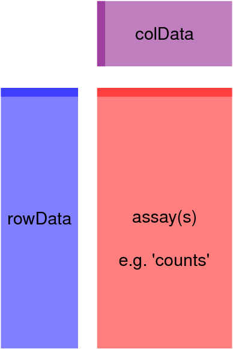

# Introduction

For today's session, we'll look at a microarray dataset and perform differential expression analysis on this set of genes.
Whilst we won't be able to get through an entire workflow, we'll be able to make a good start on this.
Along the way we'll learn:

- about a few key structures put in place by the Bioconductor community
- how to use dimensional reduction techniques to visualise patterns in your data
- how to perform hypothesis testing using a linear model as an alternative to a t-test


# Preparation

## R Markdown

In order to set ourselves up for the day, **please ensure you are in your `~/transcriptomics` folder**, and using an **R Project called `practical_5` within that folder.**
*If you have chosen a different location, some of the file paths below will not work*, so please try and find your way through that.
If you can't find your way, then please ask for help.

Begin an R Markdown and tidy up the YAML header.
Here's an example YAML header (this is actually the YAML from this instruction page).
Add your own name in the (currently missing) `author:` field if you'd like, and feel free to change or delete the title/subtitle.

```
---
title: "BIOINF3005/7160:<br>Transcriptomics Applications"
subtitle: "Week 5.2: Linear Models and Dimensional Reduction"
date: "3^rd^ April 2019"
output: 
  html_document: 
    toc: yes
    toc_float: yes
---
```

After the header, add the usual `setup` chunk.
Notice that I've added an extra line this time to ensure all figures are centre-aligned.

```{r setup}
knitr::opts_chunk$set(
    echo = TRUE, 
    message = FALSE, 
    warning = FALSE,
    fig.align = "center"
)
```

```{r hideResults, echo=FALSE}
knitr::opts_chunk$set(
  results = "hide",
  fig.show = "hide"
)
```


The libraries we'll need for today are as follows, and we'll discuss all of these as we come across them during the session.

```{r}
library(Biobase)
library(AnnotationHub)
library(ensembldb)
library(limma)
library(magrittr)
library(tidyverse)
library(ggfortify)
library(ggrepel)
library(broom)
theme_set(theme_bw())
```

## Today's Data

The dataset we'll analyse is from Prof. Simon Barry (Robinson Research Institute) [published last year](https://doi.org/10.1002/eji.201948094).
The larger dataset as published has 4 cell types, but for today we'll just be comparing T~h~ (T helper) cells which are positive or negative for the surface marker *PI16*.
These were sourced from blood samples given by researchers within Prof. Barry's group.

To obtain the dataset, please paste following code into your R Console.

```{r, eval=FALSE}
chipEffects <- url("https://github.com/UofABioinformaticsHub/transcriptomics_applications/raw/master/practicals/data/chipEff.rds") %>%
  read_rds()
```

```{r, echo=FALSE}
chipEffects <- here::here("practicals/data/chipEff.rds") %>%
  read_rds()
```


Once you have that, have a sneak peek at the data, so we know what it looks like, and so we know how many genes/samples we have.

```{r}
dim(chipEffects)
head(chipEffects)
```

You'll notice that we have column names indicating the sample type, and rownames which appear like Ensembl IDs with an `at` suffix.
This is actually what they are.
Affymetrix Array probesets often are presented in this format, and the `at` stands for Affymetrix Transcript.
It's just an old convention, and is essentially meaningless.

The values themselves are log~2~-transformed intensities after background correction and fitting across all probes in the gene-level probeset.


## Metadata

There are two types of metadata we'll need to prepare to work on this dataset

1. Metadata about *each sample*
2. Metadata about *each gene*

### Sample Metadata

As we've done in previous sessions, we'll need to extract the metadata that we need for our experiment from the column names in `chipEffects`.
Try and form the columns `array_id`, `cell_type`, `PI16` and `donor`, placing them in an object called `sampleData`.

A good starting point is the following, so please try and figure the rest out yourself.
As you're creating this, set the *PI16* column to be a `factor` with the `PI16^-^` cells as the first (or reference) level.

```{r}
sampleData <- tibble(
  array_id = colnames(chipEffects)
)
```

(*Hint: You may need `mutate()` and one or more of `str_extract()` or `str_replace_all()`*)

```{r makeSampleData, echo=FALSE}
sampleData <- tibble(
  array_id = colnames(chipEffects)
) %>%
  mutate(
    cell_type = str_extract(array_id, "Th"),
    PI16 = str_extract(array_id, "[\\+-]"),
    PI16 = factor(PI16, levels = c("-", "+")),
    donor = str_extract(array_id, "[0-9]")
  )
```

In this dataset, the cell_type will be the same (T~h~) for all samples, but for the full dataset, we would also include T~reg~.
Although the `celltype` column may feel a little irrelevant, it's still worth having in there for your own reference so that you know exactly what cell type you are working on.


### Gene Metadata

In order to create our metadata for each gene, we have a couple of strategies to choose from.

1. Use an `AnnotationHub()` object, or
2. Use `biomaRt`

Before we decide, consider the following questions

- *Will the Ensembl release make much difference to our analysis?*
- *Which version of Ensembl does `biomaRt` use?*
- *What impact would this have on reproducibility?*
- *Can we specify the version using AnnotationHub?*

If you've just skipped thinking about those issues, please go back & think about them or even ask during the session.
If you're happy you understand some of these issues, feel free to keep going.

These arrays were Affymetrix Gene Arrays, which contain probes targeting the entire length of the transcript.
The gene descriptions used at the time of analysis (2015) were based on the Ensembl Release at the time, and the actual `Chip Description File` used was not the one provided by Affymetrix (for **very good reasons**).
Aggressive filtering of genes was performed during this analysis, where genes not considered as detectable above the background signal (DABG) were removed.
(Within each gene, probes not detecting signal were also removed)
In effect we have a subset of all genes in the Ensembl Release at the time, which was most likely about Release 78.

Let's load an AnnotationHub object and see if we can find one that's appropriate.

```{r}
ah <- AnnotationHub()
ah %>%
  subset(rdataclass == "EnsDb" & species == "Homo sapiens")
```

It looks like the earliest release available here is 87.
*Should we use that as the closest we have, or should we just use the latest to ensure our research uses the most up-to-date information?*

Hopefully you'll agree with me, that the latest build will be the best best so let's load that into our session.

```{r}
ensDb <- ah[["AH78783"]]
```


Now we have this, we know that we can simply obtain the genes as `GRanges` objects using the function `genes()`.

```{r}
genesGR <- genes(ensDb)
```

There's a fair bit of information here.
*Which columns should we put in our `geneMetadata` object?*

Let's keep it simple and just plan to add the genomic location along with the `gene_id` and `gene_name`.
In reality, we can come back to this object at any time and just grab any other information that we need.

In order to setup our `geneMetadata` we'll need to turn this into a `data.frame` so let's go via a `tibble` while we're exploring.

```{r}
genesGR %>%
  as.data.frame() %>%
  as_tibble()
```

Now we know what this object looks like when we coerce it into a `tibble`, we'll hopefully start to get an idea for how we'll assemble our metadata.

```{r}
geneMetadata <- genesGR %>%
  as.data.frame() %>%
  as_tibble() %>%
  mutate(
    location = paste0(seqnames, ":", start, "-", end, ":", strand),
    affy_id = paste0(gene_id, "_at")
  ) %>%
  dplyr::select(affy_id, gene_id, gene_name, location) 
```

We're almost set to go, but have one key issue to address, which is that not all genes in the current Ensembl release will have been considered as detectable in the array dataset.
In addition to this, some Ensemble Gene IDs which were part of Release 78 may no longer be present in Ensembl 99.
To resolve this, we'll have to subset both our `geneMetadata` object and `chipEffects` object.
In addition to this, it might be a good idea to place them in the same order.
(We did this by default when we created our `sampleData` object so that our sample metadata is in exactly the same order as our arrays.)

**How could we do this?**

There are multiple ways we could subset each object, but I'll offer a suggestion.
Please check what we're doing here carefully as you may underestimate how convenient this is?
*The key steps are in the last 2 lines (`right_join()` and `filter()`).*

```{r}
geneMetadata <- genesGR %>%
  as.data.frame() %>%
  as_tibble() %>%
  mutate(
    location = paste0(seqnames, ":", start, "-", end, ":", strand),
    affy_id = paste0(gene_id, "_at")
  ) %>%
  dplyr::select(affy_id, gene_id, gene_name, location) %>%
  right_join(
    tibble(affy_id = rownames(chipEffects))
  ) %>%
  dplyr::filter(!is.na(gene_id))
```

Now that we've sorted out metadata into the same order as our expression estimates, and removed any genes no longer in the database, let's remove the deprecated genes from our expression estimates.

```{r}
chipEffects <- chipEffects[geneMetadata$affy_id,]
```

*Please note that by using a tibble, we ensured that our `affy_id` column was a character vector, not a `factor`.*
Can anyone imagine what might have happened if it was a `factor`?

At this point we have our metadata organised, and have ensured that our genes are compatible with the current genomic/transcriptomic resources (i.e. Ensembl Release 99).

## An Expression Set object

### The Expression Data

Now that we have all of data prepared and ready to go, we'll combine everything into a single object known as an `ExpressionSet`.
This is an `S4` structure developed by the Bioconductor community, which is designed to hold all of your data in a memory efficient manner, but also has multiple methods and functions which are very convenient for actually performing our analysis.

To form an `ExpressionSet` all we really need is some expression data, but we've been smart and created some very useful metadata objects which we can incorporate into this.
The simplest object (without metadata) would be.

```{r}
eset <- ExpressionSet(assayData = chipEffects)
eset
```

The expression data goes into a `slot` called `assayData`, and within that it's saved as an element called `exprs`.
This may seem complicated for our simple dataset, but as you can imagine, these structures can become quite complicated and this helps create flexible but coherent structure.
To return our expression values from the new `eset` object, we just use the function `exprs()`.

```{r}
exprs(eset) %>% head()
```


### The Sample Metadata

Within each `ExpressionSet` we can also add our sample metadata and this goes into a `slot` called `phenoData`.
Unfortunately, this is where the `tidyverse` stops playing nicely with Bioconductor, and we'll need a type of object known as an `AnnotatedDataFrame`.
To create that we'll need a plain `data.frame` with the sample names as the rownames.
This last piece of the structure is checked when we form our `ExpressionSet`, and is really quite sensible as it ensures we have the right information in the right position.

```{r}
sampleData %>%
  as.data.frame() %>%
  set_rownames(.$array_id) %>%
  AnnotatedDataFrame()
```

There's a component in this object called `varMetaData` where you can store metadata about your metadata columns, but we don't really need to worry about that here, so we can leave that blank.

Let's now add this to our `ExpressionSet`.

```{r}
eset <- ExpressionSet(
  assayData = chipEffects,
  phenoData = sampleData %>%
    as.data.frame() %>%
    set_rownames(.$array_id) %>%
    AnnotatedDataFrame()
)
eset
```

Notice that now, the `phenoData` slot has our `sampleData` tucked away in there conveniently.
Extracting this again is still easy, but is not quite as intuitive as we might expect.

```{r}
phenoData(eset)
```

This returns that `AnnotatedDataFrame` object, so to convert this into a `data.frame` we would just use

```{r}
phenoData(eset) %>%
  as("data.frame")
```

A convenience wrapper for this two step process has been written as the function `pData()`.

```{r}
pData(eset)
```


### The Gene Metadata

The gene-level metadata is referred to a `featureData` in this object type to ensure we can be flexible about what we're measuring (it might not always be a gene).
Once again, we'll need to supply this as an `AnnotatedDataFrame` with rownames that match our expression data.

```{r}
geneMetadata %>%
  as.data.frame() %>%
  set_rownames(.$affy_id) %>%
  AnnotatedDataFrame()
```

So our final object will be made like this.

```{r}
eset <- ExpressionSet(
  assayData = chipEffects,
  phenoData = sampleData %>%
    as.data.frame() %>%
    set_rownames(.$array_id) %>%
    AnnotatedDataFrame(),
  featureData = geneMetadata %>%
    as.data.frame() %>%
    set_rownames(.$affy_id) %>%
    AnnotatedDataFrame()
)
eset
```

We can return the gene metadata element using the `featureData(eset) %>% as("data.frame")` method or using the convenience wrapper `fData()`.
However, be aware that this will be a `data.frame` with many rows.
Feel free to try this, but it will just dump all the information into your Console, unlike the pretty wrapping paper that a `tibble` provides.

There are a few other optional slots that we can place data in, and these are very useful if you're publicly releasing data in this form, as you can contain all of the relevant information that you need to communicate with other researchers.
We'll skip these for now though.

## Working with an `ExpressionSet` Object

Now that we've assembled the object for today, let's look at what we've done.
The following figure is given in regard to a related object type known as a `SummarizedExperiment`, but the key principles remain.




The core of our object is the expression data (or assayData) and this represents the information that we are analysing (the red block above).
However, this structure has allowed us to add metadata about each of our features, often considered to be "row data", and this is now added as a separate, but related `data.frame`.
Similarly, we have added metadata about each column as a `data.frame`
This enables us to keep everything together in a coherent structure that is easy to work with.

In the above structure, genes are rows and samples are columns.
This means we can subset like any ordinary R object.
The following code would just return the first two samples, and the sample metadata will also be subset.


```{r}
eset[,1:2]
```


Similarly, we can subset by genes, and the gene metadata will also be subset correctly.

```{r}
eset[1:2,]
```


# Taking a Larger Viewpoint

Now that we have our data, a very common step is to look for any technical or biological differences between the samples.
This is the first Quality Assessment step performed in most analyses.

## Inspecting the distributions

One thing we need to be aware of is whether any variation in the data is technical in nature, not biological.
We've talked about normalisation for both RT-qPCR and microarrays before, so the first check we should perform is to make sure that we have equivalent amounts of signal from each sample.
This is analogous to ensuring that we have equivalent amounts of RNA hybridised to each array.
We could check this using both density plots, or boxplots.

The standard function for doing this is provided by `limma` and is `plotDensities()`.
This will automatically place a legend in the corner, and will colour each array separately.
We can modify this using `ggplot()` approaches, but for a quick inspection, this is generally fine.

```{r}
plotDensities(eset)
```

**Do you see any issues here indicating technical differences between samples?**

An alternative viewpoint would be to view these distributions from above using boxplots.
This is not such an easy one-liner though.
Here's one of the possible ways.

```{r}
exprs(eset) %>%
  as.data.frame() %>%
  rownames_to_column("affy_id") %>%
  as_tibble() %>%
  pivot_longer(
    cols = starts_with("SB"),
    names_to = "array_id",
    values_to = "log2_intensity"
  ) %>%
  left_join(
    pData(eset)
  ) %>%
  ggplot(
    aes(x = array_id, y = log2_intensity, fill = PI16)
  ) +
  geom_boxplot() +
  facet_wrap(~donor, nrow = 1, scales = "free_x")
```

We actually could've done this simply using, but I think it looks a bit ordinary.

```{r}
exprs(eset) %>%
  boxplot(col = as.integer(pData(eset)$PI16) + 1)
```

## Dimensional Reduction

When we think about our data, we have thousands of measurements for 8 samples.
This is actually high-dimensional data and can't be plotted simply in 2 dimensions.
One of the most common steps in any analysis is to try and find a way to represent each entire sample as a single point, and see how similar to each other they are on a simple 2D plot.

One common approach is *Multi-Dimensional Scaling* (MDS) which attempts to compress your data into $n$ dimensions (usually $n=2$), such that the distances between the points represent how similar they are to each other.

```{r}
plotMDS(eset, col = as.integer(pData(eset)$PI16))
```

This is a very common strategy, however many others prefer performing a *Principal Component Analysis* (PCA).
Whilst superficially similar, a PCA doesn't compress the data into $n$ dimensions, but looks for the largest source of variability and defines this as *principal component 1*.
We hope that this source of variability represents our biology of interest.

When we refer to the largest source of variability, we look for this using the thousands of measurements we have for each sample.
The maths is beyond the scope of this course, but in short we look through all of these points to find where the biggest variability is and call the PC1.

From there on, PCA looks for the second biggest source of variability, which is orthogonal to the first and defines this as *principal component 2*.
(In two dimensions, orthogonal means 'at a right angle' but this can be extended to multiple dimensions)
This process repeats until the maximum number of components is reached, which in this dataset would be $n=8$.

There is about 5 minutes worth of valuable material in a [YouTube video](https://youtu.be/_UVHneBUBW0?t=504) which may help explain this concept.

To perform a PCA on our data, I would approach it like the following:

```{r}
pca <- exprs(eset) %>%
  t() %>%
  prcomp()
```

In this code, I've taken our expression data then transposed it, as the function `prcomp()` looks across each row as the variable of interest to be summarised.
If we look at the summary of this object, we can see how much of the variance in the data is captured by each component.

```{r}
summary(pca) 
```

To make our plot, the package `ggfortify` has a very handy function called `autoplot()` which is setup for plotting the output from the function `prcomp()`.
Initially this won't look great, but we'll modify this easily as we're about to see.

```{r}
pca %>%
  autoplot()
```


Notice how the proportion of variance is shown on each axis.
However, we'll clearly want to colour and label our points.

```{r}
pca %>%
  autoplot(data = pData(eset), colour = "PI16")
```

Now we've let `autoplot()` define our basic aesthetics (x, y, and colour), we can treat this as any other ggplot object.

```{r}
pca %>%
  autoplot(
    data = pData(eset), 
    colour = "PI16"
  ) +
  geom_text_repel(
    aes(label = array_id, colour = PI16),
    show.legend = FALSE
  ) 
```

In this dataset, we can see that PI16 status does seem to track pretty well with PC1, and as such our biology of interest appears to be a primary source of variability.

# Differential Gene Expression

In our last session we used a $T$-test to compare between two groups, and this is effectively what we do  for Differential Gene Expression Analysis.
As a quick example, if we just grabbed our first gene and passed it to `t.test()`, this is what we'll do.

```{r}
x <- exprs(eset)[1,]
df <- pData(eset) %>% mutate(x = x)
t.test(x~PI16, data = df)
```

However, in the above code, we are restricted to the situation where we have **only two groups**.
In reality, we often have more than two and we need to fit this using a more complete formula.

## The Design Matrix

The most common approach to statistical analysis is to form a design matrix which contains a column for every parameter we are trying to fit, and with a row for every sample.
Fortunately, our experiment is simple, in that we have two groups so our design matrix is pretty simple.
This gives us a good chance to look at it though.

```{r}
design <- model.matrix(~PI16, data = pData(eset))
design
```

This parameterisation can appear counter-intuitive to many non-statisticians, so let's explore this a little.
Our first column allows us to estimate our baseline expression level, in our reference sample group.
Commonly in a linear model, the baseline is considered to be when our main predictor variable has the value $0$, and we can then fit the slope of the line as the next column.
Hence the name `(Intercept)`.
All we need to consider that this is going to provide the estimate of expression in our reference sample group.

When we defined `PI16` as a `factor` in our initial `data.frame`, this is where we defined our reference group.
The first factor in a categorical variable is always treated as the *intercept* or baseline term in this context.

The important thing is that the second column allows us to estimate the difference in expression due to our second condition, here when we have PI16^+^ cells.
This column is going to provide our direct estimate of logFC.

Many people wonder why we don't fit an expression estimate for each cell type separately, and then calculate the difference between them.
This can also be done and would use the following syntax:

```{r}
model.matrix(~0 + PI16, data= pData(eset))
```

This would provide estimates of expression for each cell type, and then we would have to define a second contrast matrix to compare between the two estimates.
To a statistician this seems like extra work, when the same thing can be performed in one step using the first approach.
However, there are many occasions where this is indeed the best approach.

## Fitting A Linear Model

Let's see how this model works using a simple linear fit on the first gene.

```{r}
gene1 <- lm(x ~ PI16, data = df)
tidy(gene1)
```

Here we can see that the estimate of expression in our baseline cell type (PI16^-^) is 6.52, whilst the difference in expression for PI16^=^ cells is -0.26.
In other words, the estimated logFC due to being a PI16^+^ cell is -0.26.
The non-significant $p$-value (> 0.05) indicates that we would accept $H_0$ and consider that the true average logFC that we are estimating is indeed zero.

Let's compare that to our `t.test()`"

```{r}
t.test(x ~ PI16, data = df) 
```

Notice that our sign is reversed, but our estimates and our $T$=statistics is the same.
The slight difference in the $p$_values is likely due to alternative approaches to calculating the degrees of freedom.

## Fitting the Complete Dataset

One of the advantages of our type of approach here is that we are fitting the exact same statistical model to every gene.
Once we have our design matrix, we pass this to a single function which will fit every gene.
In `limma` that function is called `lmFit()`.

```{r}
fit <- lmFit(eset, design)
```

Notice how in one simple line, we fitted all `r nrow(eset)` genes.
And it took about one second!

If you enter the object name into the Console, you'll get a bit of an information dump, but there are some  important and recognisable things here.

The first of these is the element `coefficients`.
The first column is the estimated expression in our baseline (*PI16^-^*) cell type, whilst our second column estimates the logFC for our *PI16^+^* cells.

The next element of interest is called `sigma` and this is our gene-specific estimate of the population standard deviation (also known as `s` in lectures).

Next you may notice an element called `genes`, and because we have setup our `eset` object correctly, this are now included in the output here for convenience.
Beneath the `genes` element is one called `Amean` and this is the average expression level we can use to make MA plots.


### The Moderated T-Test

As mentioned in the statistics lecture, as part of the fitting process we estimate the population variance for each gene.
In transcriptomics this is explicitly assumed to be the same across sample groups or cell types, and is provided in the `fit` object as the element `sigma`.
A near compulsory step in transcriptomics (for microarray data) is to incorporate an additional step in which an Empirical Bayes model is used to moderate these variance estimates.
This reduces false positives which are due to unrealistically low estimates of variance, and provides additional power to detect genes with a large logFC, but which were ranked too low due to an excessively large variance estimate.
To include this step, we simply call the function `eBayes()` after we've called `fit()`.
This can be done in one chain using the `magrittr`.

```{r}
fit <- lmFit(eset, design) %>%
  eBayes()
```

If we compare these moderated variances, you'll see the effect described above.

```{r plotEBayes, echo=FALSE, fig.show='asis'}
tibble(
  initial = fit$sigma,
  moderated = sqrt(fit$s2.post)
) %>%
  ggplot(aes(initial, moderated)) +
  geom_point() +
  geom_abline(slope= 1, colour = "blue") +
  labs(
    x = expression(paste(sigma, " [Initial Value]")),
    y = expression(paste(sigma, " [Moderated Value]"))
  )
```


## Obtaining a Ranked List

Now we've fitted every gene, we can get the top 10 using the simple command `topTable()`.
However, we'll need to specify the model coefficient, which is simply the column of the design matrix.

```{r}
topTable(fit, coef = "PI16+")
```

More practically, we can obtain the complete ranked list, and while we're there, we can turn it into a `tibble` and keep just the information we need.

```{r}
results <- topTable(fit, coef = "PI16+", number = Inf) %>%
  as_tibble() %>%
  dplyr::select(
    starts_with("gene"), logFC, AveExpr, t, P.Value, adj.P.Val
  )
```

- The $B$ statistic is very rarely used in modern approaches and can be ignored.
- If you think the `affy_id` column is worth keeping, feel free
- The `adj.P.Val` column contains an FDR-adjusted p-value

We can easily see how many DE genes we have to an FDR of any given value (e.g. $\alpha = 0.05$).

```{r}
sum(results$adj.P.Val < 0.05)
```

Next session we'll make some volcano plots, MA plots, check our p-values, check our expression values, learn about sample weights and more fun things.
