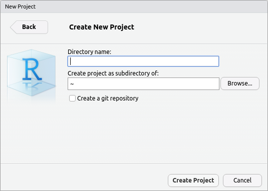

<script>
function myFunction(i) {
  var x = document.getElementById(i);
  if (x.style.display === "none") {
    x.style.display = "block";
  } else {
    x.style.display = "none";
  }
}
</script>

```{r setup, include=FALSE}
knitr::opts_chunk$set(
    echo = TRUE,
    message = FALSE,
    warning = FALSE,
    fig.align = "center"
    )
```


# Introduction

For the majority of this practical course, we will be working with the language R using the RStudio IDE.
You have all been assigned a Virtual Machine (VM) which will be yours for the entirety of this course, but will be shut down once the course is completed.
We have provided all of the software on this machine that you will require for the course, however be aware that all data on the machines will be lost once they are shut down.
If you need to transfer data to or from the VM, we recommend using stand-alone program like [FileZilla](https://filezilla-project.org/download.php)

During this course, we strongly encourage you to a) **read all of the notes carefully**, and b) **manually type all of the code**, unless directed otherwise.
This will provide you with the the most benefit.
Making mistakes is a fundamental learning experience, and this will also equip you for the future when you will have to develop your own code and perform your own analysis.

## Connecting to Your VM

**Please follow these instructions very carefully**

You will be provided with an IP address associated with your student ID, which looks something like `10.150.xx.xxx`.

1. Using your IP address, use your favourite Internet browser to navigate to `10.150.xx.xxx:8787`. 
We recommend Chrome or Firefox for this, but Safari or Explorer may work satisfactorily if you must use these.
2. You will see a login screen asking you to sign in to RStudio.
    - If you have already accessed your VM and set a new password during a Genomics Applications practical, please login use that password and skip to the [following section](#what-is-r).
    - If you **have not** accessed your VM before please read on
3. Use your Username and Password provided to login to RStudio, which is already running on the VM. 
This should take you to the following screen:


## Setting a new password

Now you have connected to the RStudio session, you are actually logged into your VM.
As the password provided is not secure, we need to change this immediately.
We understand that the approach we use here will be new for many of you, so again, please follow carefully.
At this point, it is important to note that everything we type here will be *case-sensitive*.


1. In the top left of RStudio you will see a `Terminal` tab. Please click on this and you should see a flashing cursor next to your machine id. (This id will look similar to `student@bioinf-2020s1-20200218-1:~$`.)
We are actually going to use an environment called `bash` here, but we'll come back to `bash` a bit later in the course. For now just follow along.
2. Type `passwd` followed by the <kbd>Enter</kbd> key.
**PLEASE NOTE THAT NOTHING WILL APPEAR AS YOU ENTER YOUR PASSWORD**. This is normal and is a security feature of this method.
3. Enter your old password followed by <kbd>Enter</kbd>
4. Now enter a **new password** followed by <kbd>Enter</kbd> and repeat to confirm. If you make a mistake, *the password will not be changed*, so just go back to step 2 and repeat all steps until you successfully enter the new password twice.
Please note that simple passwords will also be disallowed, so please choose something better than `password`.
5. Log out from RStudio by using the sign-out icon at the top right of your screen. This is the  symbol next to the 'power button'.
6. Log in again using your new password and you are done with the hard section for today!

Please note, course instructors will be able to access your machine for the entire course.
If we detect an unchanged password, your machine will **immediately be shut down** without warning.

## What is on the VM

For those who are interested, each VM is running the Ubuntu 18.04 operating system.
Ubuntu is one of the flavours of Linux and is the most common Linux flavour in use by bioinformaticians.
Without getting to deeply into this, Linux and MacOS share many features with regards to the architecture of the file system, and these are both quite different to Windows.
We'll gradually walk you through this during the course, but **at no stage will we interact with our VM using a conventional Desktop**.
Ubuntu does come with one, but we've not been satisfied with any of the software clients that are available to connect to the Ubuntu Desktop.
There are plenty of alternative approaches which we commonly use in bioinformatics, such as `bash` which we glimpsed above, and the RStudio Server interface which will be our primary method for connecting to our VM.

It's also very important to note that these VMs are **only accessible from a University of Adelaide campus**, or when connecting using the **University of Adelaide VPN**.
If you try to connect outside of the University network, your connection will time out.

# Introduction to R and the R Studio environment

## What is R?

R is one of the most commonly used languages/environments in modern biological research.
Whilst originally developed as a statistical teaching tool in the 1990s, a large and diverse ecosystem of packages has been developed enabling analysis of everything from financial markets, to election polls to biological research.
In particular, the vast majority of transcriptomic analysis is conducted using R.
There is truly too much to cover in a 12 week practical course, but hopefully we'll get you over the initial hurdle of unfamiliarity.

There is no such thing as a perfect programming language, and R has many features (or 'quirks') that are based in its historical origins.
However, it can be a very useful tool.
An important concept to remember from these sessions, is that we write code for two primary reasons.

1. To instruct a machine to perform the computational task
2. To communicate with other people (including yourself!)

A key advantage of R over software like Excel, is that everything you do can be recorded in some kind of pain text format.
Every change you make to your data can be seen and revisited months or years later.
Every analysis or figure can also be recreated at a later stage, or easily modified as more data points are collected.
If you accidentally 'break' or modify your data in Excel, there will literally be no record of this event, with cut and paste errors being essentially undetectable.
In R, these mistakes are (generally) easy to find and correct, ensuring reproducible and robust analysis, as well as enabling collaboration between researchers.
Unlike Excel, we rarely modify our raw data directly in R, but instead load the data into our R session, or occasionally we directly connect to it in a read-only form.

R is an *open source language*, meaning there is no software giant like Microsoft or Apple forcing you to buy their software, and hiding all the code so you don't really know what it's doing.
Instead, all of the code that runs R is publicly visible, and maintained by what is essentially a volunteer community, consisting mainly of academics spread throughout the world.

Some examples of trivial R code might be as follows.
Don't worry about typing these just yet.
Instead, have a look and try to understand everything you see at this point.
We'll come back and actually run these examples later.

```{r firstExamples, results='markup'}
x <- 1:5
print(x)
sqrt(x)
x + 1
```

You may be able to see that in the first line `x <- 1:5` we've created an object called `x` which now has the values `1:5`.
We used the `<-` symbol, which was specifically designed to look like an arrow, **to put those values into** `x`.
We are able to name our R object anything, and they can have very complicated structures.
Whilst, this may appear new, every time we open a new Excel Workbook, Excel automatically creates 3 Excel object for you (known as worksheets), and gives them the names, `Sheet1`, `Sheet2` and `Sheet3`.
All of these would be of a fixed dimension and would look like empty spreadsheets (because they are).
In `R` nothing is created for us automatically, and we can create an object of any shape, with any name that we choose.
Mathematicians have been finding `x` for centuries, so we thought we create another one for them.

After we created `x`, we performed a few operations such as showing what values are in it (`print(x)`), finding the square root of all of the values in it (`sqrt(x)`), or adding one to all of the values `x + 1`.
Again, we'll come back to this very soon.

R will always print the position of the values which start each line too, so that is why you see `[1]` at the start of each of these examples.
Although not helpful for these examples, this can be very handy when printing tens or hundreds of values.

You will also see the `##` symbol at the start of each line to clearly denote this is R output.
This is non-essential, but is a common convention.

## What is R Studio?

Whilst R itself is the language we use, we mostly interact with R using an Integrated Development Environment (IDE) called R Studio.
**We can almost think of R Studio as being like the cabin of a car, and R itself is the engine.**
Though we can tell the engine (R) exactly what to do from the cabin (R Studio), R Studio also has many features that don't directly interact with R, but that our make our lives more safe and convenient, just like a cabin will usually have a radio, air-conditioning and seat belts.
We can use R Studio as a file browser, text editor and `bash` interface as well as running version control software like `git`
For today, we'll mainly stick to the text editor (where we write our code) and file browser, although we will return to `bash` more and more as the course progresses.

Interestingly, R Studio is produced by a for-profit company called R Studio.
However, it is still [free software](https://github.com/rstudio/rstudio).
You have already been through the login process, and this is the point where you first saw what R Studio looks like to a user.
The version we are running on your VMs is RStudio Server, and this allows us to connect to a machine remotely.
You can also install R/RStudio on your own laptop, and no login would be required for this configuration.
This is actually how most people work, but by setting up the VMs, we are avoiding the inevitable difficulties that come with installing software on dozens of different laptops, and are ensuring all practicals and assessments are able to be performed.
The view you have when you open RStudio is nearly identical whether you are running locally, or on a remote machine.


```{r, echo = FALSE, out.width='100%', fig.cap="*The main RStudio interface*", results='asis'}

```

The main window you can see on the left has a few tabs available so **ensure the tab with the word Console** is now active.
*This is where we can interact directly with R itself.*
At the top you'll see the R Version listed along with a few other pieces of information, whilst underneath this you'll see the `>` symbol.
The `>` symbol **is the R prompt** and this is where can type our code that we want to execute.

On the top right you'll see another pane with three tabs.
We'll explore some of these as we go, and we'll find that  the **Environment** and **History** tabs can be very useful.

On the bottom right you'll see another pane with tabs for **Files**, **Plots**, **Help** and a few other things.
We'll definitely use those three a great deal, but the other two won't get much of a run.

## The R Console

To get a feel for how R works, let's try typing a few things directly into the R Console.
At the `>` prompt, type the following:

```{r}
x <- 1:5
```

As we discussed earlier, we've now created an object called `x` which contains the numbers `1` to `5`.
This is an R object, known as a *vector*.
We won't really spend much time talking about vectors today, but here it's a string of numbers, which you can think of as being *like a single column in a spreadsheet*.

We can view the contents of this R object either by typing it's name, or by using the function `print()`.
Mostly we don't need the `print()` function but it does come in handy sometimes.
Let's try both methods.

```{r, results='hide'}
x
print(x)
```

Just like you might call the Excel function `AVERAGE()` and select a range of values to place between the braces `()` so you can find the mean, we can do this in R using the equivalent function `mean()`, where we place our `R` object between those braces.

```{r, results='hide'}
mean(x)
```

We can use all sorts of mathematical functions like `sum()`, `max()`, `min()`, `sqrt()`, `median()`, `var()` or `sd()` on our vector.
The important point to notice is that when we call the function, we pass the R object to the function by including the object between the braces `()`, just like we did with our calls to `print()` and `mean()`.
This is very similar to how the Excel functions work, but instead of passing a range of cells, we pass an R object to the function.
**Try a few of the above commands to see how you go.**

We can also perform mathematical operations directly on our R object which, as you can hopefully see, is much easier than highlighting a range of cells in Excel.

```{r, results='hide'}
x + 1
x*2
x^2
1/x
```

## The R Environment

When working with Excel and calling a function on a range of cells, we would usually write the output to another cell in the spreadsheet.
However, in the above we just wrote the output of each function directly to the `Console` **without modifying `x`**, or **without saving the output anywhere**.
The output was just dumped into the Console.
(If you understand what `stdout` is, this is the R equivalent.
If you don't understand what `stdout` is, don't worry, we'll teach you that in a few weeks.)

Have a look at your **Environment** Tab in the top right pane, and note that you can see the object `x` there.


The R Environment is where we created the object `x` and the Environment is like our workspace where we can store any R objects, like we can have multiple sheets open in Excel.
As an example, let's save our output from that mathematical operation where we calculated $x^2$.

```{r}
x_sq <- x^2
```

Notice that the results of `x^2` were *no longer printed to the Console*, and we now have two objects in our R Environment (both `x` and `x_sq`).
**How would we view the contents of `x_sq`?**

## Creating a Vector

In the above, we initially created our object `x` by giving it the values 1 to 5.
R interprets the `:` symbol as a quick way to create a sequence from the first up to the second value, in steps of 1.
A far more common method for creating vectors is to enclose all the values we need inside the function `c()`.
This function stands for *combine*, and example may be:

```{r}
fib <- c(0, 1, 1, 2, 3, 5)
```

This example is just the start of the Fibonacci sequence, but we can use any values we want.
Notice that these were all numbers (or integers to be even more correct).
We can also specify character (*i.e.* text) vectors by quoting the supplied values.

```{r}
pets <- c("dog", "cat", "bird")
```

R has a convention that **text strings must be quoted.**
If you see text which is not quoted, *this must refer to an R object*, or sometimes it can be the column name of a spreadsheet-like object we're working with. 
If any of you forgot to include these quotation marks, you will have seen an error message.
(Try it if you're game. You won't break anything.)

As an important technical note, R *can only create vectors where all values are the same type*.
Character vectors will always display with quotes around the values when you print them in the R console.
If you mix numbers amongst text values, the numbers will automatically be coerced to text strings and will also appear with quotes, indicating they have been stored as the alpha-numeric symbols for those numbers, *but with no implicit numeric value*.
This is a key point of difference to Excel where each value is treated in isolation.
However, once you get used to it, it's very useful!


## Getting Help

Finally for this section, if you're not sure how a function works, the easiest way to call up the help page is to type the name of the function into the R Console, but with a `?` beforehand.
As an example, try typing `?sd` into the console, followed by <kbd>Enter</kbd>.
This will call up the help page for `sd()` (which calculates the standard deviation of a vector).

This function takes two arguments.

1. Any numeric vector (referred to as `x` by the function)
2. Instructions on how to handling missing values (`na.rm = FALSE`).

Some help pages can be a little harder to understand than this one but the more you use `R`, the clearer they become.
We'll check a few more throughout the course and hopefully you'll be able to make sense of them by the end of the course.
Try looking up the help page for `sqrt()` or `log()` and see if you can understand any of it.

R help pages are notorious for being crystal clear once you know what you're doing, but horribly confusing when you're trying to learn.
However, things have really improved over the past few years.

# Maintaining our code

## R Scripts

In the above section we worked exclusively in the Console and just executed code 'on the fly'.
This can be appropriate for very simple calculations, and some people even use R as their default calculator instead of the more flashy GUIs that come installed with most operating systems.
However, for more complicated work this provides no advantage over Excel and can lead to significant errors.
R does provide a short record of the last few hundred lines of code, but these are are transient records.
Click on the **History** tab next to the **Environment** tab, and you'll see all of the code that we have executed today.
This is actually stored in your current directory within a file called `.Rhistory`, which you should be able to see in your **Files** pane.


In bioinformatics, keeping track of our code is a fundamental requirement, with many analyses being performed over weeks, months or years, and involving multiple collaborators.
Clearly, relying on the few hundred lines in the `.Rhistory` file would be inappropriate.
The strategies for recording all steps from an analysis can be varied, and would typically involve some form of electronic record keeping, or version control.
However, the most basic form of record-keeping involves recording our code in a linear form, along with any other important information related to the analysis we are performed.
Typically, this is saved in some kind of plain text file.

Before the release of RStudio in 2011, most people would write R Scripts, and these are still a common format.
We advocate using R Markdown as a superior alternative to R Scripts, and will introduce these later today, but first, let's have a quick look at an R Script.
A classic script may look like the following, and would probably be saved as a file called `create_x.R`.
(There's no need to create this file).
Conventionally, R Scripts are saved as files with the suffix `.R` to make it clear to anyone what the contents of the file are likely to be.

```{r, eval=FALSE}
# Create an object called x
x <- 1:5
# Find the largest value
max(x)
# Hmm. That's exactly what I expected
```

There are a few important points to note here:

- An R Script would be a plain text file, able to opened with TextWrangler, Notepad, Notepad++, SublimeText, Atom, vim, nano, emacs or any other text editor. 
**Do you think the file `create_x.R` could be opened with MS Word?**
- There are three lines here which are messages to ourselves, or to our collaborators.
These are known as *comments*, and they start with the `#` symbol. 
Once R sees this symbol, everything after it is ignored until the <kbd>Enter</kbd> or `end-of-line` (EOL) symbol is given to the Console, so these lines here contain no code that will be executed.
- Beyond the comments, there are two lines of code that would be executed.
**If you can't identify these two lines, please ask a tutor.**

### Comments

We won't explore the R Script format any further, however the concept of a comment needs a little deeper exploration.
Commonly, we'll need to share our analysis with a collaborator or supervisor who won't have access to your brain as it was while you performed the analysis.
We'll need to communicate why we're doing something in plain English, and identify any concerns and strategies for resolving these.
Alternatively, you may like to consider that for many analyses, you'll return to them after a considerable break, and you also won't have access to your brain as it was while you performed the analysis.
Comments are an excellent way of communicating to yourself and reminding yourself why you did something.

Learning how to write comments is actually a very important skill as you develop as a bioinformatician.
Sometimes the code itself is self-explanatory, and you may include a large chunk of comments at the top describing your overall process.
Other times a specific line or two may need explanation as to why something less obvious is being performed.

<!-- <button onclick="myFunction('myDIV')">Click Me For A Hot Tip!</button>   -->
<!-- <div id="myDIV" style="display: none;"> -->

<!-- **Hot Tip: No, you won't remember why you did something! Don't kid yourself.**   -->

<!-- </div> -->


When we write code for an analysis, there are realistically **two** essential functions that we are performing.

1. We are telling the computer what calculations to perform, and what steps to take, in what order.
2. We are communicating with every person involved in the project. 

This second point is often overlooked by naive programmers, **ALWAYS** leads to frustration, and can often lead to a lack of reproducibility.

## R Projects

As we're actually about to start saving files to our VMs, let's take a moment to get ourselves organised.
When working on an analysis, a very helpful strategy is to keep all of your raw data, analytic code and output in a dedicated folder.
In RStudio, a system called `R Projects` has been implemented, which is an extremely simple but effective way to keep yourself organised.
There is no mystery or magic to these as they are little more than a shortcut to a folder, but they do help us develop good practice.
The only reason to not use R Projects, is if you intentionally wish to make your life harder.

In your VM, you'll notice that in the **Files** pane, it will be telling you that you're in your **Home** () directory.
A common symbol used to represent this is `~`, so whenever you see `~` in a file path, this represents your home folder.
We'll learn more about file paths as we go through this course.

In the **Files** pane, we can actually create new directories.
Directly below the word **Files**, you'll see a `New Folder` icon ().
Click on this and type `transcriptomics_applications`, ensuring everything is lower case and you use an underscore between words, **NOT** white-space.
Once you've executed this, you'll see the new directory in your **Files** pane.
We'll use this directory in the next section, and we can keep all of our course content here!


### Create a New Project

Now we have a suitable folder for our R Project, in the top right of your RStudio screen, you'll see the following symbol: { width=120px }.

1. Click the arrow
2. New Project... (choose `Don't Save` when prompted)
3. New Directory
4. New Project

This will get you to this form:



The cursor should be flashing in the `Directory name:` field, so please click the <kbd>Browse...</kbd> button then enter the `transcriptomics_applications` directory, followed by <kbd>Choose</kbd>.
The cursor will once again be flashing in the `Directory name` field so please enter `practical_1` as the directory name, followed by <kbd>Create Project</kbd>.

This will start a clean R session, where have no record of our previous work, and you'll notice that in the **Files** pane we are now in the directory `~/transcriptomics_applications/practical_1`.
Inside this directory will be the file `practical_1.Rproj` which functions as a shortcut to this directory, but can also be used to store any customisations you make to the project.
We won't look at these today, but may tweak things later during the course.
These `.Rproj` files are also useful for setting correct file paths during an analysis, however, they are little more than a convenient shortcut, and as their job is to make our lives easier, we shouldn't rename or move them.

NB: If you are not in the exact directory `~/transcriptomics_applications/practical_1`, **you may be disadvantaging yourself for the remainder of the course and for any assessments that are set**. 
**Please ensure you have this completely correct with all lower case characters and an underscore separating words**.
Call an instructor over if you cannot figure the above steps out, or if you are lost. 


## Introducing R Markdown

The primary record-keeping format we'll use for this course is R Markdown.
This is another plain text format which allows us to write our code, but instead of using comments, we can use *formatted paragraphs in plain language* to explain what we're doing to our collaborators and to our future selves.


Note that in the above toy example of an R Script, there were no results embedded.
If we'd wanted to include the output from `max(x)` in our R Script, we would've had to copy the output from the Console, and place it in the script as a comment.
In addition to simple code/paragraph format of R Markdown, we can actually embed our results, including tables and figures in our final document.
Essentially, we can produce a beautifully formatted report as we're building our analysis.

R Markdown itself is an extension of the common `markdown` format in which simple formatting is encoded into a plain text document.
The R Markdown format, simply allows embedding of R code alongside our clearly-formatted paragraphs and sections.

As we'll see, when we create an R Markdown document we have our code in one document, which we then compile into a secondary PDF, HTML report, slide presentation or even an MS Word document or PowerPoint presentation.
As we compile our final document, we can include results that are generated as the document is created.

## Creating an R Markdown Document

First we’ll inspect a complete document, then we’ll piece together one ourselves throughout the remainder of the week.

1. Go to the File drop-down menu in R Studio
2. New File -> R Markdown...


Once you have that New R Markdown form open

1. Change the Title to: My First Report
2. Change the Author to your own name
3. Leave everything else as it is and hit <kbd>OK</kbd>
4. Save the file as RMarkdownTutorial.Rmd

Notice that by default, you will be asked to save this in the project root directory `~/transcriptomics_applications/practical_1`.
This is a simple example of how using an R Project helps us to save files in intelligent places and manage our analysis without losing track of where our files are.
Many analyses involve dozens or hundreds of files, so managing all of those can become a non-trivial undertaking if you don't learn good practice from the beginning.

Notice there are a few different colours here indicating section headings (in blue) and R code (with a grey background).
We'll explore this in detail next, but in essence this is all just plain text that RStudio is making look pretty for us.
From here, click the <kbd>Knit</kbd> button at the top of the R Markdown document, and this will produce a beautifully formatted HTML report.


A new html window should open (be careful of any pop-up blockers you have running) so let's go through this in detail and see what we've actually done.

## Understanding R Markdown

### The YAML Header

At the top of our R Markdown document is our YAML header.
YAML stands for YAML Ain't Markup Language, which is one of those recursive acronyms that programming nerds find hilarious.
We don't have to worry about the acronym, but the key points are

1. The YAML header is contained between the two sets of `---` lines at the beginning of the document.
2. Nothing can appear before this header!!!
3. We can set the title, author and date here. Notice how these are printed at the top of your html document.
4. We can also define our output format here. By default we chose an `html_document`, but could also choose `pdf_document` or `word_document`

Try changing the output format by clicking the down arrow next to the word **Knit** and selecting `Knit to PDF`, then `Knit to Word`.
Notice that by doing this, the YAML header was automatically changed by RStudio.

Once you've had a good look at the different formats, reset this back to `html_document` by deleting those changes and manually setting the last line of the YAML header to be `output: html_document`, as in the above image.
Test that your document compiles again to make sure everything works, and you should see the original html report open up again.

### Code Chunks

The YAML header is probably the hardest thing about R Markdown, and it's not that hard really, so let's keep looking.
Lines 8-10 are what we refer to as a code chunk.

    ```{r setup, include=FALSE}`r ''`
    knitr::opts_chunk$set(echo = TRUE)
    ```

Code chunks always start with with `` ```{r} `` and  end with `` ``` ``, whilst executed `R` code goes between these two delineators.
There's no real need to worry about what this exact code chunk is doing, but if you're still following along, it's setting the behaviour for all code chunks below it, where `echo = TRUE` means that all code will be visible in your final report.
We'll explore this later on too.

Chunk names (e.g. `setup`) are optional in R Markdown, and directly follow the `` ```{r ``.
Naming chunks in a large analysis can be good practice and can help you find where everything is more easily, but this comes down to your preference.
We do strongly advocate for naming code chunks though, as we have learned the hard way that tricks which make your life easier, generally do make your life easier.
The two seconds it takes to name a chunk can save much more time than that as your analysis develops.

You'll also notice that after the chunk name, the argument `include = FALSE` was set.
This argument will only apply to the specific chunk it is in, and here `include = FALSE` tells **Knit** to hide the code and the output, unless there is a figure being created by the chunk.
If you check the html document, you'll see that this chunk is not visible.

On lines 18-20 you'll see another code chunk

    ```{r cars}`r ''`
    summary(cars)
    ```
    
This is calling the function `summary()` on a data object called `cars` that comes pre-installed with `R`.
We don't need to worry about the actual values, but you'll see that the code is visible (`echo = TRUE` from the first chunk) and that the results from execution of the code have been prefaced with `##` symbols.
This can be turned off, but is common practice for presenting direct R output in an R Markdown document.

The third chunk we can see is 

    ```{r pressure, echo=FALSE}`r ''`
    plot(pressure)
    ```
    
Notice that the code for this chunk has been hidden (`echo = FALSE`), but that the plot generated by execution of the code is still visible.

### Section Headings

After our first code chunk, you'll see `## R Markdown` which has been printed on the html document as a section heading.
In markdown (and R Markdown), an increasing number of hash symbols change a line from a Section heading (`##`) to a Subsection heading (`###`), or a Subsubsection heading (`####`) and so on.
This is a convenient way of controlling the appearance of your output without having to go through the rigmarole of formatting in MS Word.
If it hasn't dawned on you yet, this entire tutorial was written in R Markdown.


### Plain text formatting

Notice that in Line 16, the word **Knit** is surrounded by two asterisks on each side.
This is how we set **bold font** in markdown, with an alternative being two underscores (\_\_).

We can also set italics, by enclosing text in a pair of single asterisks.
Try surrounding the phrase `a document will be generated` with an asterisk at either end.
You'll notice that RStudio will automatically highlight this phrase in light blue, and when you knit the document again, this text will appear in italics, as expected.

Further down on line 30, you'll see that the phrase `echo = FALSE` has been enclosed by a backtick (\`) at either end.
This will cause text to be rendered in what's known as `typewriter font` and is conventionally how code is represented in markdown.

A significant advantage of R Markdown, is that instead of using comments, we can communicate in formatted text to our collaborators, supervisors or our future selves.
There are many other simple formatting tricks available in R Markdown, and you can see a brief help using `Help` > `Markdown Quick Reference` in the drop-down menu.
There also extensive cheat sheets available, but they may overwhelm you at this early stage.
R Markdown is really quite powerful.

### Navigation Tips

As well as being able to format text and specify section headings, insert pictures etc., R Studio provides a navigation pane.
Click the staggered text symbol () at the top-right of your R Markdown page.

Here you'll see all of the section headings and clicking on these will take you to that part of the document.
Chunk names can also be shown, but this is turned off by default so we'll need to set this manually.
Using the drop-down menu at the top of R Studio, choose: `Tools` > `Global Options...` > `R Markdown`.
Once you're on this page, look for the text `Show in document outline:` and using the drop-down menu set this to `Sections and All Chunks`, then <kbd>OK</kbd>.
Now all of our chunks will appear in the navigation pane.

Clearly this is a simple document but in the real world, R Markdown documents can be hundreds or thousands of lines long.
Being able to navigate easily is quite advantageous.

# Running Code Interactively

## Using Our Default Template

Now that we've had a good look through R Markdown and all of the available options, we should start to build our own workflow.
All we've seen in the above is our plain text R Markdown file being converted into an html document, and where the code is executed whilst the document is being compiled.

In reality, we would start with an empty document and will build up a workflow from scratch.
To do this, we'll probably need to write code and *check that it works as we go.*

As we may have ascertained, code within an R Markdown document is not been executed as you type it, but is just a plain text record of some code which may or may not be executed at some point.
In order to actually **execute a line of code** we have several options.

#### Method 1: <kbd>Ctrl</kbd> + <kbd>Enter</kbd>

1. Use your mouse to set the cursor anywhere on the line `summary(cars)`.
2. Press <kbd>Ctrl</kbd> + <kbd>Enter</kbd>

Here you'll see the results appear in your R Markdown document as a kind of preview.
Whilst the code was actually executed in the Console, some people like to use this setting as the default so that their results are always visible underneath the code that generates them.
Many others prefer to unambiguously execute code in the Console without this preview.
This tends to keep a document looking cleaner while you work on it, as the previews can take up a fair bit of space and make things look messy.

To remove these previews, go to the Settings icon at the top of your R Markdown document ({height=18px}).
Once the drop-down menu appears, select `Chunk Output in Console`, then choose <kbd>Remove Output</kbd> when prompted.
This will remove the existing preview and now when we send code to the Console, all output will appear there.

Make sure your cursor is back on the line that says `summary(cars)`, and hit <kbd>Ctrl</kbd> + <kbd>Enter</kbd> again.
Now the output will appear in the Console.

#### Method 2: <kbd>Ctrl</kbd> + <kbd>Alt</kbd> + C

The above method can be used for executing a single line and works whether you are in an R Script, or in an R Markdown document.
In an R Markdown document, you can use the <kbd>Ctrl</kbd> + <kbd>Alt</kbd> + C shortcut to execute every line in a code chunk.
You can also jump to the next chunk using <kbd>Ctrl</kbd> + <kbd>Alt</kbd> + N.
This strategy can help you quickly run through an analysis.

#### Method 3: For those who like to click

A final option for those who prefer to click on things, would be to click the green 'play arrow' at the RHS of each chunk.
The 'down arrow' can also be used to run all chunks above the current one.
As you become more confident, you'll probably move away from the compulsion to click on things.

# Writing our own code

As a final step for this week's practical, let's create our own content.
Using your mouse, select everything from the `## R Markdown` header to the end of the file and delete all of the selected text.
Compile the report just to convince yourself that it's now empty, apart from the title, author and date from the YAML header.

Make a new section header: `Creating an R Object`, and enter text similar to the below after this header

> To create an object in R, we first enter the name of the object, followed by the assignment operator (<-) and the values we wish to place in the object.

Now we've explained the process to our future selves, let's create our favourite vector `x`, with the values `1:5`.
We'll need to place this code inside a chunk, so after the above text, create a new chunk by either manually typing `` ```{r} `` to begin the chunk, followed by `` ``` `` to close the chunk.
Or we can use the R Studio shortcut <kbd>Ctrl</kbd> + <kbd>Alt</kbd> + I to create an empty chunk.

Name the chunk whatever you choose, however a good trick may to use the name of any objects you're creating as the chunk name.
Inside the chunk, write the code to create `x` with the values `1:5` and **compile the document to make sure you haven't made any mistakes.**

After this chunk, start a new paragraph and include the following text.

> In our object `x`, the largest value is 5 and the smallest value is 1.

**Recompile the document.**

### Including in-line code

As well as executing code in code chunks, we can evaluate very simple code in our plain text paragraphs.
Earlier, we discovered that `R` has the functions `min()` and `max()`.
Change the last paragraph to read

> In our object `x`, the largest value is `` `r knitr::inline_expr("max(x)")` `` and the smallest value is `` `r knitr::inline_expr("min(x)")` ``.

**Recompile the document.**

Notice how these simple pieces of R code have been executed within the paragraph they are contained.
This can be very useful when performing an analysis and needing to include descriptions of our data, such as the number of samples, the number of detectable genes, or anything similar.
This also makes our analysis robust to new data points arriving, as we will just need to change our data importing or data setup prior to this paragraph, whilst all inline summaries will automatically include any new data points.

As a simple example, change your object `x`, so that it is now the values `1:10`, and recompile your document.

Using whichever version of `x` that you prefer, now add the text 

> We can also perform mathematical operations directly on an entire vector in a single command. This is much simpler than selecting a range of values in Excel, and printing the results to another cell in an Excel workbook.

    ```{r basic_maths}`r ''`
    x + 1
    x*2
    x^2
    1/x
    sqrt(x)
    ``` `r ''`
    
Notice how R Markdown includes the `##` symbol at the start of each line of results, and that each line of code within the same chunk is name broken up by the output of each line.

Create a new chunk containing the object `x_sq` and recompile to check your code.

Now let's make a simple plot of `x` and `x_sq`

    ```{r make_plot}`r ''`
    plot(x, x_sq)
    ``` `r ''`

(Recompile to check everything works)

When we create plots and figures, we may like to include a figure caption.
This can be done by setting the `fig.cap` argument in the chunk header.
In the above chunk, place a comma after the name, followed by `fig.cap = "Plot of x vs x^2^"`.
This will appear under your plot as a figure caption, and also note that we've used the *superscript formatting* trick here too.

Now that we've introduced most of the key concepts for working interactively in R, keeping our code organised and using R Markdown, we're ready to start importing and looking through data.
This will be the topic for next week's practical sessions.


