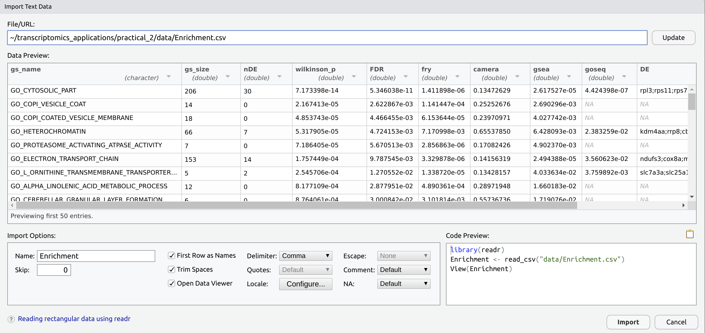
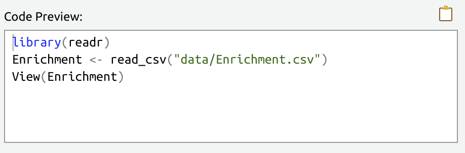

<script>
function myFunction(i) {
  var x = document.getElementById(i);
  if (x.style.display === "none") {
    x.style.display = "block";
  } else {
    x.style.display = "none";
  }
}
</script>

```{r setup, include=FALSE}
knitr::opts_chunk$set(
    echo = TRUE,
    message = FALSE,
    warning = FALSE,
    fig.align = "center",
    results = "hide"
    )
if (interactive()) setwd(here::here("practicals"))
```

# Introduction

In our previous sections, we learned how to document our workflow using R Markdown using plain-text paragraphs and R code embedded in the same document.
Once we'd learned that, we spent some time learning how to manipulate text strings.
For today's session, we'll introduce a more common object type, known as a data frame (or tibble) which resembles a spreadsheet.
Firstly, we'll import the file into R, and then we'll learn how to manipulate the data object inside the R environment.

## Setting up our workspace

Before we go any further, we need to keep developing our good programming practice.
If you don't already have an R Project for `practical_2`, create a new project with this name as a subdirectory of your `transcriptomics_applications` directory.
**Call a tutor over if you can't remember how to do this.**

Once you have an R Project ready to go for `practical_2`, create a new directory called `data` within this directory.
Copy the file `Enrichment.csv` to this directory.

Once you have `Enrichment.csv` in your `data` directory, begin a new R Markdown document and save this as `DataImport.Rmd` in your project root directory.
As per usual, delete everything after the `setup` chunk.

## Introducing The Tidyverse

Previously we saw the package `stringr` which was dedicated to manipulating text strings.
Today we're going to learn about functions from the packages `readr`, `dplyr`, `tibble` and `tidyr`.
Because these packages are very tightly integrated, the authors decided to create a further package called the `tidyverse` which enables the loading of the eight core packages (`ggplot2`, `tibble`, `tidyr`, `readr`, `purrr`, `dplyr`, `stringr` and `forcats`) in one command.
An entire programming culture has sprung up around these packages, which is often referred to as the `tidyverse` or `tidy` data, or something similar.
In essence, the release of these packages and their ease of use, opened R up to a far wider community.
All of these packages are maintained by staff from RStudio, in particular Hadley Wickham, who is one of the most influential figures within the international R community.

{height=250px}  
*Hi! I'm Hadley Wickham & I wrote/designed most of the tidyverse. I'm originally from New Zealand, so my functions use English spelling instead of US spelling. Yay!*
(source: https://github.com/hadley)

After your `setup` chunk, create a new chunk called `packages` and enter the following code.

```{r packages}
library(tidyverse)
```

This will load all 8 of the packages that were described earlier when executed.
Compile your document and inspect the output.

You'll probably notice that this chunk has been rather "chatty" and provided an unexpected amount of output in your final document.
The first time you execute this chunk in an interactive session you would have seen the same output appear in your Console (or in your R Markdown if you have it set for that).
This is what's known as a `message` in R, and is just communicating information to us.
It may look like like some kind of error, but this one isn't.

The first few lines are informing us what packages have been loaded, and which versions they are.
After `--Conflicts-----` should be two lines letting us know that the function `filter()` from `dplyr` is the first one `R` will look for in the session, and now takes precedence of the function `filter()` from `stats`.
Similarly for the function `lag()`.
This really isn't super relevant for us, so we can ignore all of this.

One convenient piece of syntax that is shown here is the use of namespaces.
As we can see that two packages have functions called `filter()` that are currently available to use.
If we wish to specify which exact one to use, we can put the package name before the function name, and separated by a double colon (`::`).
Formally, this is known as a namespace which is essentially a list of functions made visible by loading a package.
If we're wanting to be sure that we're using `filter()` from `dplyr`, we could write `dplyr::filter()` instead of just using `filter()` and hoping that R figures it out.
We won't come across too many instances of this today, but the more packages we learn about, the more of a useful trick it becomes.

Given that this output is going to make our compiled document look a bit uglier, we can hide this type of output by setting the chunk argument `message = FALSE`.
We can do this in the chunk header for this chunk only, or we can add it to our `setup` chunk, inside the call to `knitr::opts_chunk$set()` after `echo = TRUE`.
We'll have to separate these with a comma, but this will then become a global setting so that all messages from any chunks are hidden.
This is my preferred option for all of my R Markdown documents.
(Notice the use of the namespace trick here to ensure that `opts_chunk$set()` from the package `knitr` is called.)

# Importing Data

Now we've started our R Markdown document and tidied up our output, let's get on with importing data.
First, we'll use the convenient GUI that R Studio provides, but then we'll ditch this and just use code in the style that we've already seen.

## Using the GUI

The file we'll work with today is called `Enrichment.csv` and contains some actual results from a transcriptomic analysis comparing mutant and wild-type zebrafish.
This data was generously provided by Prof. Michael Lardelli who does some excellent work in the context of Alzheimer's Disease.
As this is a csv file, we know this will be a plain-text file, with columns separated by the comma symbol.

Using the **Files** pane, navigate into the `data` folder and click on the file `Enrichment.csv`.
When prompted, select `View File` and the file will open in your script window, allowing us to have a sneak peak at it.
Note, that **we haven't loaded it into your R Environment**.
We're just opening it like we open any plain-text file to have a look at the contents.
Once you're happy with what it looks like as plain-text, close it by clicking the cross next to the file name and return to your **Files** pane.

Click on the file again, but this time select `Import Dataset`.
A GUI will now open and you should see an image like the following:



If the `Data Preview` part of the preview is blank, click the <kbd>Update</kbd> button and it will refresh.
(This seems a bit glitchy sometimes.)
**Don't click <kbd>Import</kbd> just yet.**

Notice that in the main `Data Preview` section that R Studio has figured out:

1. We have comma-separated values. The suffix `.csv` is how it guessed this.
2. The first row contains column names
3. What type of values are in each column. You can see the data type in brackets underneath the column names.

An vitally important feature of the GUI is in the bottom right, where we have been given a preview of the **actual code that will be executed** to import that data into R.



Here, there are three lines which we need to understand

1. `library(readr)`
2. `Enrichment <- read_csv("data/Enrichment.csv")`
3. `View(Enrichment)`

**Using your mouse, select and copy these three lines** then click the <kbd>Import</kbd> button and some crazy magic will happen.
You'll probably find yourself looking at an Excel-like preview, so before we move on, go to `DataImport.Rmd` and create a new chunk.
Name the chunk `import` then paste these lines of code into the chunk.

Let's see what we've actually done

### `library(readr)`

The first line is telling `R` to load the package `readr`.
This package contains the function `read_csv()` which is what parses the plain-text file into the R Environment.
We've already loaded this package in our first chunk as part of the `tidyverse`, so we can actually delete this line from our `import` chunk. (Please do so.)

### `Enrichment <- read_csv("data/Enrichment.csv")`

The second line is where the importing actually happens.
Hopefully this looks like normal R code to you know, where we have an object name (`Enrichment`) followed by the assignment operator (`<-`).
The data that we're placing into this object is the output from the function `read_csv()`, and notice that here we have simply given the file path to this function, and it's done the rest.

The GUI has automatically decided on the object name `Enrichment` as this was taken from the file name by dropping the `.csv` suffix.

### `View(Enrichment)`

The third line has opened up our Excel-like preview.
For those who really like this format, this can provide a familiar way to inspect your data.
However, for those who are R purists, this actually looks horrifying!
Once you've had a quick browse, close the preview.

We're also going to delete this third line from our `import` chunk.
This preview is designed for interactive inspection of the data, and when we're compiling our R Markdown document we can't interact with the data like this.

An alternative way of viewing the data object is to simply enter the name of the object in the **Console**.
Do this, and notice all of the information that has been presented to you here.

1. `# A tibble: 500 x 10`: This is a type of object known as a `tibble`, which is based on a `data.frame`, but wrapped in lovely wrapping paper so it looks nice. Notice that this output also tells us how many rows (500) and columns (10) that we have.
2. After that we have all of the column names, with the data type shown in grey underneath each column name.
3. Then we are shown a preview of the first 10 rows of data, followed by `# … with 490 more rows`.
This is a great feature of tibbles, as a `data.frame` would dump all 500 rows onto the screen. Each column has also been truncated in the display so you get a peek at what every column looks like, without seeing all of the data.
For this dataset, so of the columns are very, very wide so this also makes out lives easier.

These features are why many R users prefer this preview, as you can see all of that important summary information as well as having a sneak peak at the contents.
Using the Excel-like `View()` command, in some people's opinions, is actually **less** informative.

### Changing the Defaults

All of the settings for `read_csv()` were guessed by the R Studio GUI and for the most part, these will be correct.
Can we change these using the GUI?

Re-open the GUI by clicking on the file, but once again don't click <kbd>Import</kbd>.

1. Try changing the name to `enrichment` at the bottom left, then click anywhere else in the GUI. You'll notice that the Code Preview has updated to reflect this.
2. Uncheck the `First Row as Names` check-box.
**Clearly, this would be a bad idea for this dataset**.
However, notice that the column names have now changed, the types of data in each column have changes, and the code has changed to include the argument `col_names = FALSE`.
Re-check the check-box to make sure we don't accidentally do anything silly.
3. Uncheck the `Open Data Viewer` check-box. **What changed?**
4. Change the `Delimiter:` drop-down menu to anything other than a comma. Although this would also be a bad idea for this dataset, notice that the code changes along with the preview. This may be useful if you have tab-separated data, or if you have any other delimiter. 
5. Click the <kbd>Cancel</kbd> button to make sure we import anything silly into our R Environment.

In our last change above, the import function changed to `read_delim()` instead of `read_csv()`.
`read_delim()` is actually the main function whilst `read_csv()` is actually a wrapper with all arguments preset to values that work for a `csv`.
Additional functions like `read_tsv()` do the same thing for tab-separated files.

## Using Code to Import Data

Returning to our R Markdown.
As you may have now figured out, we've kept the only line from our code that performs the actual data import.

```{r import}
Enrichment <- read_csv("data/Enrichment.csv")
```


Have a look at your **Environment** Tab and you'll see `Enrichment` sitting there.
Now that we've saved our code for the import, click the broom symbol next to `Import Dataset` ().
This will delete the object from your R Environment.

Now execute the chunk that has the import code, and it will reappear in your Environment.
This is your first taste of *reproducible research*.
We no longer have to click on everything, but can write the code to perform an operation.

After your `import` chunk, include the following lines.

> The object `Enrichment` was imported, which contained `` `r knitr::inline_expr("nrow(Enrichment)")` `` gene sets.

Now compile your document and check the document we have generated.
It'll be pretty simple, but we've effectively automated data import, and printed a quick summary of some important information.

## What is in this object

In this object, we have `r ncol(Enrichment)` columns (`r pander::pander(colnames(Enrichment))`), each of which contains different pieces of information.

1. `gs_name`: This is the name of the gene set that we have tested for being enriched in our results
2. `gs_size`: This is the number of genes in the complete gene set
3. `nDE`: This is the number of genes in the gene set that were formally considered as *differentially expressed* (DE) between the two genotypes
4. `wilkinson_p`: Is our p-value for enrichment after combining multiple tests
5. `FDR` is an adjusted p-value which tells us what proportion of our results are likely to be false if we choose the corresponding value from `wilkinson_p` as our threshold of significance
6. `fry, camera, gsea` and `goseq` are four different analyses we performed on our data. We then combined these p-values (using Wilkinson's method) to obtain the value `wilkinson_p`. (For reference, `goseq` needs a list of formally declared DE genes, whilst the other analyses work on ranked lists.)
7. `DE` is the all of the gene names formally considered as DE that belong to each gene set

We're now going to explore a whole series of functions in the package `dplyr` which we can use to extract key results from our enrichment analysis.

# The Package `dplyr`

Just like `readr` contains a series of functions designed to read data into R, the package `dplyr` contains a huge set of functions for working with tibble objects.

## What is a `tibble`

The main object type we will work with today is a `tibble`, which is an extension of the basic R structure called a `data.frame`. 
In short, these are very much like spreadsheets with clear rows and columns, but there are a few key points we should just make a note of:

1. All values in a column **must be of the same type** (i.e. `character`, `numeric`, `integer`, `logical`), however, each column *can be of a different type to the other columns*
2. **All columns must be the same length**
3. **Column names must be specified.** If not, R will add generic column names
4. *Row names are optional.*

This final point is one of the things that sets a `tibble` apart from a `data.frame`. 
Whilst a `data.frame` **can** have row names, a `tibble` **cannot**, and will drop them by silently setting them to the row number.
This is a design feature enforced by Hadley Wickham, and can initially seem a little strange (and is much argued about amongst the R community).
However it can provide a little more flexibility when dealing with non-trivial data structures. 
Other features which make `tibble` objects a slightly more convenient version of a `data.frame` are:

1. When you type the object name, only the first few rows are displayed. A `data.frame` will dump the entire contents into your R Console if you just type its name
2. Only the first few columns are displayed, with a summary of the remaining columns given. Once again, a `data.frame` will dump its entire contents into your R Console
3. The type of value contained in each column is shown
4. The dimensions of the object are shown

Beyond this, they are essentially identical structures and a `tibble` can just be thought of as a `data.frame` with pretty wrapping paper. 
Sometimes, you will hear `tibble` objects referred to as `data.frame` objects as this is their basic class, so hopefully this won’t cause any confusion.

### Subsetting a `tibble/data.frame`

Regardless of which type of `data.frame` or `tibble` that you have, we can subset the object using square brackets after the object name, with rows and columns specified using `object[row,column]`.
We could just print the first row of `Enrichment` using `Enrichment[1,]`
Or we could print the first 3 columns using `Enrichment[,1:3]`.
Combining the two to print the the first 5 rows and first 5 columns would be `Enrichment[1:5, 1:5]`

We can also call columns or rows by name, although given that tibbles have no rownames, rownames cannot be used for tibble objects.
Note that when doing this, we use the c() function to combine the names we want.

```{r, results='hide'}
Enrichment[1:5, c("gs_name", "nDE")]
```

In general, we encourage using column names, rather than the numeric positions. 
This can be more robust if you accidentally change the column order, and is also far easier to understand when other people (e.g. you in the future when you’ve forgotten what you did in the past) read your code.

Another common way to extract information from a single column is to use the `$` symbol, and the square brackets. In this case, our column is treated as a vector and we only need to specify the position in the brackets, without a comma. 
In the following, we’ll just grab the first two gene sets.

```{r}
Enrichment$gs_name[1:2]
```

Although we haven't formally mentioned it, this is also how you can subset a vector, like the `hi` vector we used last time.

## Introducing `dplyr`

The above methods are the traditional ways of accessing data within a tibble or data.frame. 
Another package written by Hadley Wickham is `dplyr` which introduces a variety of additional strategies for manipulating these objects, and is loaded as part of the `tidyverse`. 
These functions not only make sense to an Excel user, but enable extremely powerful approaches for data manipulation.

### Using `select()` to select columns

Whilst we have already seen how to select columns using conventional strategies, `dplyr` introduces a new function `select()` which enables you to select columns.
(Most functions in `dplyr` have intuitive names.)
The strategy here is to pass our `tibble/data.frame` as the first argument to the function, and then to just list any columns we wish returned. 
Column names can be quoted, or given that they are columns within the data frame we’re working with, they can also be unquoted. 
We also no longer need to use the c() function to combine our column names.

```{r}
select(Enrichment, gs_name, gs_size)
```

The above example of `select()` may also seem pretty simple, but given the helper functions which `dplyr` includes, this approach becomes extremely powerful. 
These common helper functions are: `contains()`, `starts_with()`, `ends_with()`, `one_of()` and `everything()`.

An example of this may be just to extract the `gs_name` and `gs_size` columns.

```{r}
select(Enrichment, starts_with("gs_"))
```

**What would've happened if we'd just used `starts_with("gs")`?**

Although `everything()` may initially seem pointless, we can also this within select `select()` to rearrange our columns.

```{r}
select(Enrichment, contains("DE"), everything())
```

If we wish to remove columns we just place the `-` symbol before the column names, or helper function.

```{r}
select(Enrichment, -contains("DE"))
```

**Notice that through the above calls to `select()`, we never overwrote our original object, because we never used the `<-` symbol to assign anything to a new object.** 
`select()` simply takes a `tibble/data.frame` as input and returns the same.

### Using `arrange()` to sort columns

A common strategy in Excel is to sort your data by the values in a particular column. 
The function that `dplyr` introduces is `arrange()` and it behaves very similarly to `select()` in that we pass it the object, then call the columns we wish to sort by.
Similarly, the object will not be overwritten, but if a `tibble` is provided as input, a `tibble` will be returned as output.

By default, we have given you the object sorted by the `wilkinson_p` column. 
If we wish to sort by gene set size, we would sort on the `gs_size` column.

```{r}
arrange(Enrichment, gs_size)
```

This will sort in increasing order by default, but to switch this to decreasing order, we can wrap the column name in the `desc()` function.

```{r}
arrange(Enrichment, desc(gs_size))
```

Now the largest gene sets are the first ones shown.

### Using `filter()` to subset our results

Yet another common strategy in Excel is to use the auto-filter to restrict the values shown to those matching a given criteria. 
We can do this using the `filter()` function, which behaves similarly to the previous functions we’ve seen, but this time we need to perform a logical test on our column(s) of interest. 
Let’s just get the gene sets which contains at least one DE gene.

```{r}
filter(Enrichment, nDE > 0)
```

We can also combine filtering criteria for more complex strategies.
Here we can ask for the significant gene sets (FDR < 0.05) which contain at least one DE gene

```{r}
filter(Enrichment, nDE > 0, FDR < 0.05)
```

### Using `slice()` to obtain rows

Whilst `filter()` can be very useful for returning rows that match a given criteria, sometimes we do want to call rows by position. 
A classic example, may be if we just want to show the top 10 genes in a given list, and to do this, we can use the function `slice()`.

```{r}
slice(Enrichment, 1:5)
```

Importantly, we use `filter()` to filter rows **based on a given criteria**, but we use `slice()` to return rows **based on their position** in the original object.

### Using `mutate()` to add columns

The final thing we might like to do with our tibble object is to add a column. 
To add columns using `dplyr`, we can use the function `mutate()`.

In the following code, we’re adding a new column called `PropDE` by dividing the number of DE genes, by the total gene set size 

```{r}
mutate(Enrichment, prop_DE = nDE / gs_size)
```

If you can't see the contents of this column, temporarily drag the R Studio panel divider so that the **Console** is wide enough to show all columns.
Again, we haven’t yet overwritten our original object. 
We’ve just passed it to the function `mutate()` which has returned another tibble, but this time with one additional column.

The column `gs_name` contains gene sets from three sources.
These are the GO data base, the KEGG data base and a list of gene sets from the MSigDB data base known as the HALLMARK gene sets.

We can use some of the functions we learned when we were exploring `stringr` to obtain this information.


```{r}
mutate(
  Enrichment,
  source = str_extract(gs_name, "(GO|KEGG|HALLMARK)")
)
```


### Using `rename()`

One final function we'll introduce in this section is `rename()`, which can be used to rename columns. (Surprise!)
For this function, we provide the new name for each column that we wish to rename

```{r}
rename(Enrichment, n_de = nDE)
```


## Combining Functions

In the above sections, we have have seen many of the core functions in `dplyr`, however, this is really just scratching the surface of what we can do.
Often we would like to combine some of these functions to produce some output.
For example, we might like to `arrange()` our data by some key value, then just show (`slice()`) the top 10 values for our results table.

With our current knowledge, we would have two strategies available to us.

1. We save the output of the first function as a new object, then pass this as the input to the second function, or
2. Wrap the functions inside each other

If using strategy 1, we would end up with a workspace filled with similar objects, which would rapidly become a confusing mess.
If using strategy 2, it would work, but it might look ugly and be hard to understand for your collaborators.

```{r}
slice(
  arrange(Enrichment, desc(nDE)),
  1:5
)
```

Even doing this it's pretty clear, that we'd probably want to remove some of the columns from our output table.
We could do this, but even though I've tried to make the next chunk look readable, it's still starting to get messy.
And that's just after performing two trivial things!

```{r}
slice(
  arrange(Enrichment, desc(nDE)),
  1:5
)[,c("gs_name", "gs_size", "nDE", "wilkinson_p", "FDR")]
```

### Introducing the `magrittr`

If you are familiar with `bash`, you may have come across the pipe as a way of chaining multiple functions together.
If you're not familiar with `bash`, you're still going to learn a useful new trick.

R has a special tool called the `magrittr` (or sometimes called the pipe) which is the symbol `%>%`.
What this does is takes what is given to it on the left, and places this as the first argument of a function on the right.
For example, the following two lines of code are functionally identical!

```{r}
arrange(Enrichment, desc(nDE))
Enrichment %>% arrange(desc(DE))
```

In the second line, we have taken the output of Enrichment (which is a `tibble`) and passed it to the function `arrange()` as the first argument.
As you may have just figured out, **we could also take the output of `arrange()`** (which is also a `tibble`) ** and pass it to another function, such as `slice()`.

```{r}
Enrichment %>% 
  arrange(desc(DE)) %>%
  slice(1:5)
```

Notice how this is much easier to read than our previous attempt!
As we join several functions together, it's also very good practice to **place each function on it's own line*.
This greatly assists readability, particularly as you will often end up with chains of 10-20 operations.
R Studio will indent each line for you automatically so you can see where the chain starts and finishes.

In our earlier attempt, we also just grabbed the columns we wanted to, and now we could add an extra call to `select()` to manage that.

```{r}
Enrichment %>% 
  arrange(desc(DE)) %>%
  slice(1:5) %>%
  select(starts_with("gs_"), nDE, wilkinson_p, FDR)
```

#### Task 

**Try and write a code chunk that performs the following:**

1. Restrict the results to significant gene sets, using an FDR below 0.05 as your criteria
2. Restrict this list to gene sets with at least 1 DE gene
3. Find the proportion of genes in the gene set which are DE
3. Sort them in descending order, based on the proportion of DE genes
4. Provide the final output as the gene set name, the gene set size, the proportion of DE genes and the FDR
5. Rename the columns `nDE` and `FDR` to be `n_de` and `fdr` respectively.


### Grouping values

Given that we have data from three sources, we might wish to obtain some summaries for each of these.
`dplyr` provides the function `group_by()` to allow this.
First let's obtain the information describing the source of the gene set, as we did above, but then we should have a look to make sure we have everything right.

```{r}
Enrichment %>%
  mutate(source = str_extract(gs_name, "(GO|KEGG|HALLMARK)")) %>%
  select(gs_name, source) %>%
  print(n = 20)
```

Let's group by this new column and see what happens

```{r}
Enrichment %>%
  mutate(source = str_extract(gs_name, "(GO|KEGG|HALLMARK)")) %>%
  group_by(source)
```

As may have noticed, nothing happened, except for one thing.
If you check the top of the output, you'll see `# Groups:   source [3]`, which tells us that R is now keeping track of the 3 groups in the column `source`.
We can pass this to the function `tally()`, which will count how many rows belong to each group.

```{r}
Enrichment %>%
  mutate(source = str_extract(gs_name, "(GO|KEGG|HALLMARK)")) %>%
  group_by(source) %>%
  tally()
```

### Using `summarise()`

Maybe we might like to find the lowest FDR-adjusted p-value for each group.

```{r}
Enrichment %>%
  mutate(source = str_extract(gs_name, "(GO|KEGG|HALLMARK)")) %>%
  group_by(source) %>%
  summarise(lowest = min(FDR))
```

We could even find the distribution of gene set sizes for each source

```{r}
Enrichment %>%
  mutate(source = str_extract(gs_name, "(GO|KEGG|HALLMARK)")) %>%
  group_by(source) %>%
  summarise(
    smallest = min(gs_size),
    mean = mean(gs_size),
    largest = max(gs_size)
  )
```

### Using `summarise_at()`

Once we start wanting to apply multiple functions to one or more columns, we can use the function `summarise_at()`.
We can use our unquoted column names or helper functions to select the columns, but they do need to be wrapped in another function `vars()`.
This seems a bit clunky, but it does the job.
Also notice that when we specify the functions, we provide names that become column names.

```{r}
Enrichment %>%
  mutate(source = str_extract(gs_name, "(GO|KEGG|HALLMARK)")) %>%
  group_by(source) %>%
  summarise_at(
    vars(gs_size), 
    c(smallest = min, mean = mean, largest = max))
```


